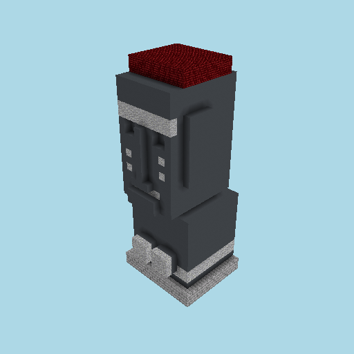
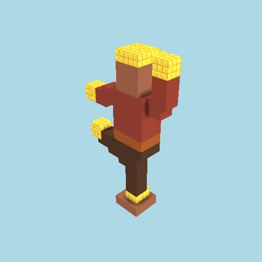
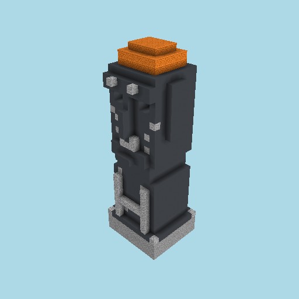
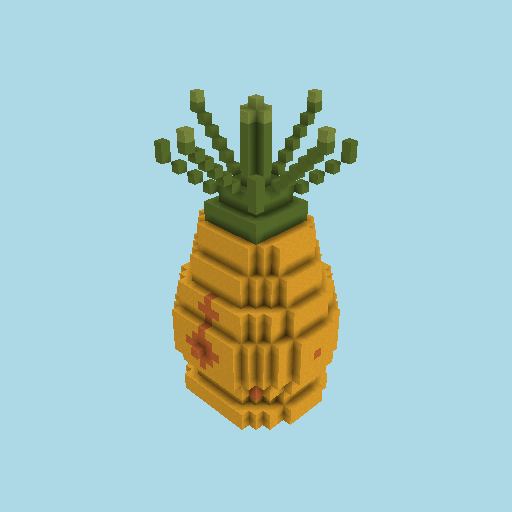
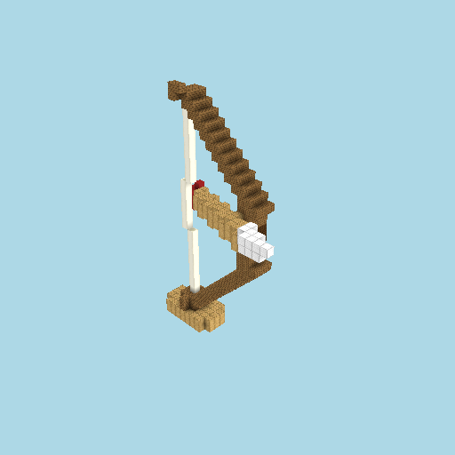
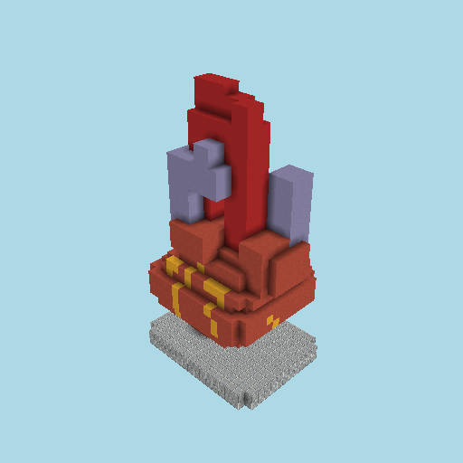
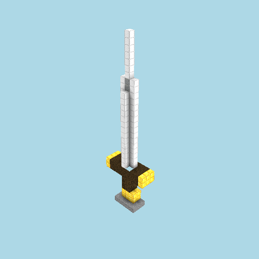
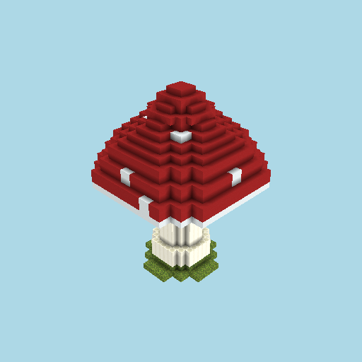
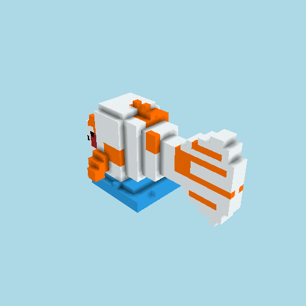

# Sculpture benchmark — vConcept (term → freestanding 3-D object)

The `vConcept` **sculpture mode** (E-13 / T-035-01): turn a single **term** into a freestanding
Minecraft-block sculpture and photograph it as a **3/4 still** plus a front-arc **rock turntable**.

```
npm run bench:sculpture -- --subject "moai" --scale 32 --note "what changed"
```

Flags: `--subject "<term>"` (required) · `--scale <N>` blocks along the longest edge (8–64,
default 32) · `--frames N` turntable frames (default 24) · `--note "..."` · `--model <id>` ·
`--effort low|medium|high`.

## Pipeline (one approach, three model stages)

1. **Imagined design doc** — `composeSculptureDesignDocPrompt` → `requestText`. A finalized,
   reasoned design document for a freestanding object (form/proportion in the round, a color-theory
   palette, block-scale motifs). No reference photo. → `design-doc.md`.
2. **3/4 concept image** — the BAML `SculptureConceptPrompt` rendered to text, piped to **Nano
   Banana** (Gemini) → ONE three-quarter concept of the object isolated on solid black. → `concept.png`.
3. **3-D build** — `composeSculptureBuildPrompt` → `requestDesignArtifactWithImage`, grounded on the
   concept image. A freestanding object occupying x/y/z (NOT a facade) → a schema-valid
   `DesignArtifact`. → `artifact.json`.
4. **Render** — a 3/4 hero still (`render-3q.png`) and a rock turntable (`turntable/frame.NNN.png`)
   via the shared orbit rig (`oscillateAzimuths` + `renderOrbit`).

Prompt wording lives in `src/sculpture.mjs` (pure, unit-tested in `src/sculpture.test.mjs`); this
benchmark is the live I/O + rendering + run-dir provenance around it.

## Known limitations

- **Single-view reconstruction.** The 3-D build is grounded on exactly **one** 3/4 concept image. The
  **back and far sides of the object are not depicted** — the model infers them as a plausible,
  symmetric continuation of the visible form. They are a reconstruction from a single view, not
  designed surfaces. This is the standing case for an **image→3D** model (e.g. TRELLIS), deferred in
  E-13. The **rock** turntable rocks only the front hemisphere (±40° about the 3/4 azimuth)
  deliberately, so the weaker imagined back is never paraded as if designed.
- **Block-scale fidelity frontier.** Angular/faceted subjects (moai, sword) realize best in
  text-JSON; thin/linear (bow & arrow) and smooth-organic (koi, heart) forms have the largest
  concept→voxel gap. Recorded per run for the E-13 fidelity read.
- **Live & metered.** Needs the `claude -p` subscription, `GEMINI_API_KEY` (Nano Banana), and headless
  GL for rendering — it does not run under `npm test`.

<!-- RUNS:START (generated by run.mjs — do not edit by hand) -->

| # | date | subject | scale | blocks | tok in/out | $ | note |
|---|------|---------|-------|--------|-----------|---|------|
| 1 | 2026-06-05 | `moai` | 32 | 3414 | 20578/18096 | $0.6632 | T-035-01 smoke |
| 2 | 2026-06-05 | `a dancing man` | 32 | 1073 | 20399/11363 | $0.4945 | T-036-01 build |
| 3 | 2026-06-05 | `a moai statue` | 32 | 2402 | 20379/14273 | $0.5684 | T-036-02 build (E-13/S-036): angular monolith — text-JSON best case |
| 4 | 2026-06-05 | `a pineapple` | 32 | 3314 | 20931/31040 | $0.9905 | T-036-03 build |
| 5 | 2026-06-05 | `a bow and arrow` | 32 | 411 | 21453/34999 | $1.0938 | T-036-04 build |
| 6 | 2026-06-05 | `an anatomically correct human heart` | 32 | 2648 | 21139/16883 | $0.6406 | T-036-05 build |
| 7 | 2026-06-05 | `a sword` | 32 | 166 | 22298/9677 | $0.4663 | T-036-06 build |
| 8 | 2026-06-05 | `a mushroom` | 32 | 4411 | 20587/17201 | $0.6459 | T-036-07 build |
| 9 | 2026-06-05 | `a koi fish` | 32 | 1997 | 20022/21719 | $0.7560 | T-036-08 build |

## Gallery

### 001 — `moai` (scale 32) · 2026-06-05



**3414 blocks** · 20578/18096 tok · $0.6632

> T-035-01 smoke

### 002 — `a dancing man` (scale 32) · 2026-06-05



**1073 blocks** · 20399/11363 tok · $0.4945

> T-036-01 build

### 003 — `a moai statue` (scale 32) · 2026-06-05



**2402 blocks** · 20379/14273 tok · $0.5684

> T-036-02 build (E-13/S-036): angular monolith — text-JSON best case

### 004 — `a pineapple` (scale 32) · 2026-06-05



**3314 blocks** · 20931/31040 tok · $0.9905

> T-036-03 build

### 005 — `a bow and arrow` (scale 32) · 2026-06-05



**411 blocks** · 21453/34999 tok · $1.0938

> T-036-04 build

### 006 — `an anatomically correct human heart` (scale 32) · 2026-06-05



**2648 blocks** · 21139/16883 tok · $0.6406

> T-036-05 build

### 007 — `a sword` (scale 32) · 2026-06-05



**166 blocks** · 22298/9677 tok · $0.4663

> T-036-06 build

### 008 — `a mushroom` (scale 32) · 2026-06-05



**4411 blocks** · 20587/17201 tok · $0.6459

> T-036-07 build

### 009 — `a koi fish` (scale 32) · 2026-06-05



**1997 blocks** · 20022/21719 tok · $0.7560

> T-036-08 build

<!-- RUNS:END -->
