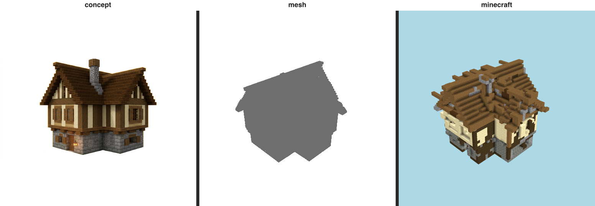

# Resemblance gate — cottage (T-076-01)

The E-22 gate: does the build LOOK LIKE its immutable references? The **triptych is the verdict a human
inspects** (Rule 2); the perceptual numbers below only EXPLAIN it.

## Triptych (the verdict) — `concept | mesh | minecraft` (labeled)

  `benchmarks/sculpture/resemblance/cottage-triptych.png`

## Categorical judge — _offline: not run_

- **verdict:** `(not run)`
- **named gap (Rule 7):** _(none)_
- **rationale:** offline: metered judge not called

## Perceptual diagnostics (Rule 2 — NOT the verdict)

| axis | value | reads against |
| ---- | ----- | ------------- |
| form IoU (vs mesh) | 0.928 | the 3-D form reference |
| form IoU (vs concept) | 0.629 | the concept (approx. 3/4 view) |
| material set agreement | 0.5 | same materials at all? (0..1) |
| material zone agreement | 0.418 | materials in the same places? (0..1) |
| mean zone ΔE | 35.23 | per-cell Lab drift (lower better) |

Build dominant blocks: tuff×4265, spruce_planks×2333, sandstone×1385, dark_oak_log×1007, cobblestone×652, dark_oak_planks×65.
Concept snapped blocks: gray_terracotta, cartography_table, polished_diorite, white_stained_glass, crafting_table, white_stained_glass.

> Honesty: concept is an APPROXIMATE 3/4 view (camera mismatch depresses IoU/zone ΔE); zoning is read
> from render pixels, not 3-D block positions. These are diagnostic — the triptych + judge are the verdict.
