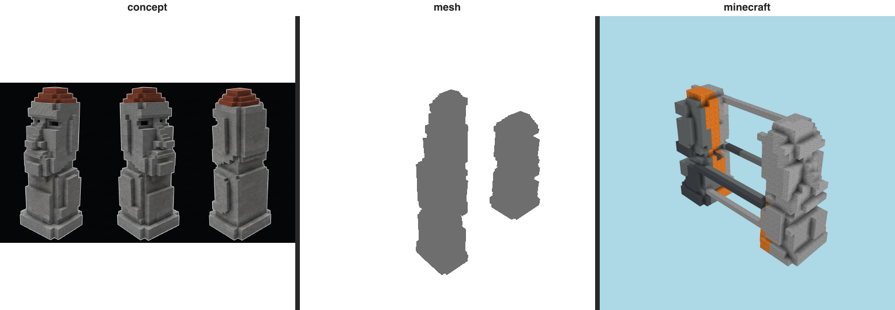

# Resemblance gate — moai (T-076-01)

The E-22 gate: does the build LOOK LIKE its immutable references? The **triptych is the verdict a human
inspects** (Rule 2); the perceptual numbers below only EXPLAIN it.

## Triptych (the verdict) — `concept | mesh | minecraft` (labeled)

  `benchmarks/sculpture/resemblance/moai-triptych.png`

## Categorical judge (metered)

- **verdict:** `different object`
- **named gap (Rule 7):** **form** — _overall body — the connected masses and horizontal rails_
- **rationale:** Instead of a single upright moai the build reads as two fragmented stone masses joined by orange-and-gray horizontal beams, so the standing-statue form is not recognizable.

## Perceptual diagnostics (Rule 2 — NOT the verdict)

| axis | value | reads against |
| ---- | ----- | ------------- |
| form IoU (vs mesh) | 0.417 | the 3-D form reference |
| form IoU (vs concept) | 0.281 | the concept (approx. 3/4 view) |
| material set agreement | 0.9 | same materials at all? (0..1) |
| material zone agreement | 0.86 | materials in the same places? (0..1) |
| mean zone ΔE | 14.32 | per-cell Lab drift (lower better) |

Build dominant blocks: stone×1003, red_sandstone×615, cyan_terracotta×326, andesite×163, gray_concrete×85.
Concept snapped blocks: gray_stained_glass, warped_nylium, coal_ore, deepslate_iron_ore, cracked_stone_bricks, light_gray_stained_glass.

> Honesty: concept is an APPROXIMATE 3/4 view (camera mismatch depresses IoU/zone ΔE); zoning is read
> from render pixels, not 3-D block positions. These are diagnostic — the triptych + judge are the verdict.
