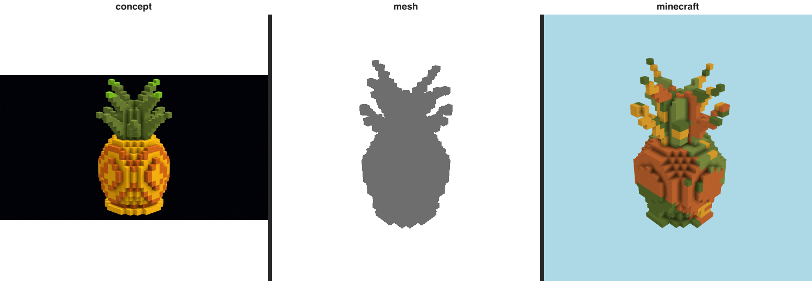

# Resemblance gate — pineapple (T-076-01)

The E-22 gate: does the build LOOK LIKE its immutable references? The **triptych is the verdict a human
inspects** (Rule 2); the perceptual numbers below only EXPLAIN it.

## Triptych (the verdict) — `concept | mesh | minecraft` (labeled)

  `benchmarks/sculpture/resemblance/pineapple-triptych.png`

## Categorical judge (metered)

- **verdict:** `drifted`
- **named gap (Rule 7):** **palette** — _fruit body_
- **rationale:** The spiky crown and rounded body read as a pineapple, but the body has gone dark brown with green bleeding into it instead of the concept's golden-yellow rind.

## Perceptual diagnostics (Rule 2 — NOT the verdict)

| axis | value | reads against |
| ---- | ----- | ------------- |
| form IoU (vs mesh) | 0.908 | the 3-D form reference |
| form IoU (vs concept) | 0.815 | the concept (approx. 3/4 view) |
| material set agreement | 0.917 | same materials at all? (0..1) |
| material zone agreement | 0.3 | materials in the same places? (0..1) |
| mean zone ΔE | 30.12 | per-cell Lab drift (lower better) |

Build dominant blocks: orange_terracotta×1941, lime_terracotta×1022, green_concrete×308, yellow_terracotta×126.
Concept snapped blocks: green_terracotta, moss_block, lime_terracotta, raw_gold_block, smooth_red_sandstone, honeycomb_block.

> Honesty: concept is an APPROXIMATE 3/4 view (camera mismatch depresses IoU/zone ΔE); zoning is read
> from render pixels, not 3-D block positions. These are diagnostic — the triptych + judge are the verdict.
