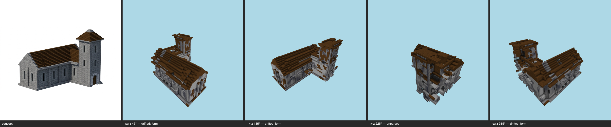

# Challenge milestone — church (T-095-01)

One command, the whole E-25 chain: provision (GLB+map, untuned) → shell integrity (T-091) → regularization cage (T-102) → concept-derived zones (T-092) → E-24 full-shell skin → multi-angle same-object gate (T-093). **Reproducible**: double-run byte-identical, final sha256 `0d5db5ac29f2cc0a…`.

## Provision (challenge subject — first contact with the pipeline)
Scale 48, 11423 cells, 4 manifest blocks — GLB + committed material map, zero tuning.

## Shell integrity (T-091)
Strip 70 → 3 components (505 cells); voids 1992 filled (minDepth 3); plug 737 cells / 1 iter → **CLOSED** (before: 7675/7704 reachable). Openings honored: window, window, window, window, window, window, window, window, window, window, window, window, window, window, window, window, window, window, window, window, window, window, window, window, window, window, window, window.

## Regularization cage (T-102)
- **open** ACCEPTED (removed 6, added 0, plugged 5)
- **close** ACCEPTED (removed 0, added 3186, plugged 32)
Spikes 602 → 217; ragged 24.3% → 14.0%; IoU vs GLB held at all 4 azimuths (caged, rejected steps rolled back).

## Skin (T-086/T-092/T-090/E-23/T-087/T-088)
Zone map: **concept** — band0 y0..16 `cobblestone`; roof `dark_oak_planks`. Derived vs committed record: **diverged** (chain runs on the repaired shell; recorded, not gated).
Substitution `{"cobblestone":"stone","stone_bricks":"polished_basalt"}`; kit kit/church.json. Fill 2057; salt 357 stripped. Coverage gate **final PASS** — band0 `stone` 32% · band0:offslab `null` ? · roof `dark_oak_planks` 80%. Bands: roof 99%, residue band0 0%.

## Multi-angle gate (T-093) — **REFUSAL (unparsed:-x-z)**

| view | azimuth | coverage | verdict | gaps |
|---|---|---|---|---|
| +x+z | 45° | pass | drifted | major form@nave roof; minor form@tower roof/cap; minor palette@walls and roof color zones |
| +x-z | 135° | pass | drifted | major form@nave roof ridge and edges; minor material zoning@tower upper section; minor palette@tower walls |
| -x-z | 225° | pass | unparsed | — |
| -x+z | 315° | pass | drifted | major form@nave and tower roofs; minor form@upper walls under the eaves |

Gate record: `benchmarks/sculpture/multi-angle/church-challenge.json` (the sheet is the verdict artifact — E-25 Rule 1).

## Evidence
- final -x-z: benchmarks/sculpture/challenge/church/view-final-oblique225.png
- final front: benchmarks/sculpture/challenge/church/view-final-front.png
- final top: benchmarks/sculpture/challenge/church/view-final-top.png

Frames: pr/assets/frames/challenge-church-after.png

> provision→shell→skin is a pure function of the committed inputs (concept PNG, material map, GLB, kit); two in-process executions byte-matched on every artifact; --repro re-proves from a fresh process. LLM-authored inputs are one-time committed records; the gate judge is the pinned model, single sample per view, verdicts committed in the gate record.
