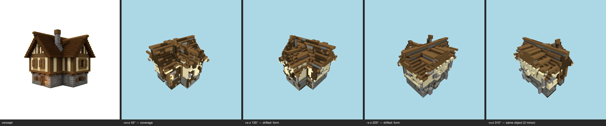

# Challenge milestone — cottage (T-095-01)

One command, the whole E-25 chain: shell integrity (T-091) → concept-derived zones (T-092) → E-24 full-shell skin → multi-angle same-object gate (T-093). **Reproducible**: double-run byte-identical, final sha256 `dbe9a083461d8888…`.

## Shell integrity (T-091)
Strip 24 → 1 components (156 cells); voids 958 filled (minDepth 3); plug 462 cells / 1 iter → **CLOSED** (before: 2417/2424 reachable). Openings honored: window, window, window, window, window, window, window, window.

## Skin (T-086/T-092/T-090/E-23/T-087/T-088)
Zone map: **concept** — band0 y0..6 `stone_bricks`, band1 y7..16 `white_terracotta`; roof `dark_oak_planks`. Derived vs committed record: **diverged** (chain runs on the repaired shell; recorded, not gated).
Substitution `{"stone_bricks":"tuff","white_terracotta":"sandstone"}`; kit kit/cottage.json. Fill 1993; salt 413 stripped. Coverage gate **final PASS** — band0 `tuff` 75% · band1 `smooth_sandstone` 71% · roof `spruce_planks` 72%. Bands: roof 100%, residue band0 0% · band1 0%.

## Multi-angle gate (T-093) — **FAIL** (gaps 8/2)

| view | azimuth | coverage | verdict | gaps |
|---|---|---|---|---|
| +x+z | 45° | REJECT | judge-not-called | — |
| +x-z | 135° | pass | drifted | major form@roof; minor massing@roof eaves/overhang; minor material zoning@upper walls vs stone base |
| -x-z | 225° | pass | drifted | major form@roof across the whole top; minor material zoning@upper timber-framed storey walls; minor palette@roof timber/plank coloring |
| -x+z | 315° | pass | same object | minor form@roofline and eaves; minor material zoning@upper timber-frame wall |

Gate record: `benchmarks/sculpture/multi-angle/cottage-challenge.json` (the sheet is the verdict artifact — E-25 Rule 1).

## Evidence
- final -x-z: benchmarks/sculpture/challenge/cottage/view-final-oblique225.png
- final front: benchmarks/sculpture/challenge/cottage/view-final-front.png
- final top: benchmarks/sculpture/challenge/cottage/view-final-top.png
- e23-before -x-z: benchmarks/sculpture/challenge/cottage/view-e23-before-oblique225.png

Frames: pr/assets/frames/challenge-cottage-before.png, pr/assets/frames/challenge-cottage-after.png

> provision→shell→skin is a pure function of the committed inputs (concept PNG, material map, GLB, kit); two in-process executions byte-matched on every artifact; --repro re-proves from a fresh process. LLM-authored inputs are one-time committed records; the gate judge is the pinned model, single sample per view, verdicts committed in the gate record.
