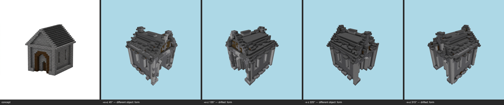

# Challenge milestone — gatehouse (T-095-01)

One command, the whole E-25 chain: shell integrity (T-091) → concept-derived zones (T-092) → E-24 full-shell skin → multi-angle same-object gate (T-093). **Reproducible**: double-run byte-identical, final sha256 `e4467844ffb4056d…`.

## Shell integrity (T-091)
Strip 23 → 3 components (221 cells); voids 820 filled (minDepth 3); plug 54 cells / 1 iter → **CLOSED** (before: 389/389 reachable). Openings honored: window, window, door, window, window, door.

## Skin (T-086/T-092/T-090/E-23/T-087/T-088)
Zone map: **concept** — band0 y0..20 `stone_bricks`; roof `deepslate_tiles`. Derived vs committed record: **diverged** (chain runs on the repaired shell; recorded, not gated).
Substitution `{"stone_bricks":"polished_basalt"}`; kit kit/gatehouse.json. Fill 170; salt 245 stripped. Coverage gate **final PASS** — band0 `polished_basalt` 74% · roof `deepslate_bricks` 63%. Bands: roof 100%, residue band0 0%.

## Multi-angle gate (T-093) — **FAIL** (gaps 12/2)

| view | azimuth | coverage | verdict | gaps |
|---|---|---|---|---|
| +x+z | 45° | pass | different object | major form@roofline / overall upper massing; major massing@front entrance (the arched doorway); major material zoning@facade surfaces |
| +x-z | 135° | pass | drifted | major form@roof and upper structure; minor form@walls and facade openings; minor palette@overall stone-and-dark-trim coloring |
| -x-z | 225° | pass | different object | major form@roof / upper mass; major massing@overall building footprint and silhouette; major material zoning@front face — columned portico vs plain arched wall |
| -x+z | 315° | pass | drifted | major form@perimeter walls; minor form@roof eaves; minor massing@overall body |

Gate record: `benchmarks/sculpture/multi-angle/gatehouse-challenge.json` (the sheet is the verdict artifact — E-25 Rule 1).

## Evidence
- final -x-z: benchmarks/sculpture/challenge/gatehouse/view-final-oblique225.png
- final front: benchmarks/sculpture/challenge/gatehouse/view-final-front.png
- final top: benchmarks/sculpture/challenge/gatehouse/view-final-top.png
- e23-before -x-z: benchmarks/sculpture/challenge/gatehouse/view-e23-before-oblique225.png

Frames: pr/assets/frames/challenge-gatehouse-before.png, pr/assets/frames/challenge-gatehouse-after.png

> provision→shell→skin is a pure function of the committed inputs (concept PNG, material map, GLB, kit); two in-process executions byte-matched on every artifact; --repro re-proves from a fresh process. LLM-authored inputs are one-time committed records; the gate judge is the pinned model, single sample per view, verdicts committed in the gate record.
