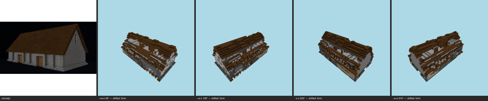

# Multi-angle same-object gate — barn (challenge) — T-093-01

**The sheet is the verdict artifact** (E-25 Rule 1); this table is support.

Artifact: `benchmarks/sculpture/challenge/barn/artifact.json` (sha256 `80b66189c637…`) · zones: prior-fallback (no-field-cells) · contract: +x+z, +x-z, -x-z, -x+z @ 30°, 512², coverage ≥ 0.5, gap budget 2

| view | azimuth | rendered | T-088 coverage | judge verdict |
|---|---|---|---|---|
| +x+z | 45° | yes | pass | drifted major form @ roof ridge and slopes major massing @ long walls and overall body minor palette @ roof and walls overall |
| +x-z | 135° | yes | pass | drifted major form @ roof ridge and slopes major massing @ long wall and eave line minor material zoning @ overall stone-vs-timber zoning across walls and roof |
| -x-z | 225° | yes | pass | drifted major form @ roof major massing @ long walls / overall enclosure minor material zoning @ stone wall zone vs timber |
| -x+z | 315° | yes | pass | drifted major form @ roof ridge and slopes major massing @ overall body and long walls minor palette @ roof and walls |

## Resemblance aggregate (T-093)
**FAIL** — gaps 12/2; failures: +x+z:drifted, +x-z:drifted, -x-z:drifted, -x+z:drifted

## Kit presence (T-100)
not run — no-kit-record

## Kit-aware verdict
**FAIL** — resemblance fail ∧ kit presence not run (the judge cannot pass a build missing kit entries; the kit check cannot replace the judgement)
