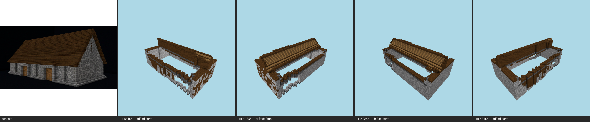

# Multi-angle same-object gate — barn (generated) — T-093-01

**The sheet is the verdict artifact** (E-25 Rule 1); this table is support.

Artifact: `benchmarks/sculpture/generated/barn/artifact.json` (sha256 `6b3b352f3b98…`) · zones: concept · contract: +x+z, +x-z, -x-z, -x+z @ 30°, 512², coverage ≥ 0.5, gap budget 2

| view | azimuth | rendered | T-088 coverage | judge verdict |
|---|---|---|---|---|
| +x+z | 45° | yes | pass | drifted major form @ walls and overall body major massing @ roof covering over the nave minor form @ front facade and door |
| +x-z | 135° | yes | pass | drifted major form @ roof major massing @ building interior / overall mass minor material zoning @ stone walls |
| -x-z | 225° | yes | pass | drifted major form @ roof major massing @ upper structure / interior minor material zoning @ loose ridge beams instead of a clad roof plane |
| -x+z | 315° | yes | pass | drifted major form @ roof, near slope over the whole length major massing @ building interior visible from above (open top / floorless shell) minor palette @ stone walls and dark-wood roof material |

## Resemblance aggregate (T-093)
**FAIL** — gaps 12/2; failures: +x+z:drifted, +x-z:drifted, -x-z:drifted, -x+z:drifted

## Kit presence (T-100)
**PASS** — every kit entry present at its grammar sites

Skips (recorded): frame (all-flagged); course (all-flagged); openings:infill (kit names no treatment for this slot); openings:shutters (kit names no treatment for this slot); openings:door (no door-kind aperture declared by the concept (T-099 D7 — detector gap, not absence))

## Kit-aware verdict
**FAIL** — resemblance fail ∧ kit presence pass (the judge cannot pass a build missing kit entries; the kit check cannot replace the judgement)
