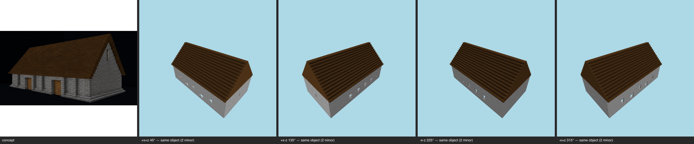

# Multi-angle same-object gate — barn (patternbook) — T-093-01

**The sheet is the verdict artifact** (E-25 Rule 1); this table is support.

Artifact: `benchmarks/sculpture/workshop/barn/final-artifact.json` (sha256 `58bc3725dbab…`) · zones: concept · contract: +x+z, +x-z, -x-z, -x+z @ 30°, 512², coverage ≥ 0.5, gap budget 2

| view | azimuth | rendered | T-088 coverage | judge verdict |
|---|---|---|---|---|
| +x+z | 45° | yes | pass | same object minor material zoning @ long wall openings minor form @ gable apex trim |
| +x-z | 135° | yes | pass | same object minor material zoning @ long side wall windows minor form @ roof pitch slightly shallower than concept gable |
| -x-z | 225° | yes | pass | same object minor palette @ long roof slope minor material zoning @ side wall openings |
| -x+z | 315° | yes | pass | same object minor massing @ long side wall minor form @ wall openings |

## Resemblance aggregate (T-093)
**FAIL** — gaps 8/2; failures: (all):gap-budget

## Kit presence (T-100)
**PASS** — every kit entry present at its grammar sites

Skips (recorded): frame (all-flagged); course (all-flagged); openings:infill (kit names no treatment for this slot); openings:shutters (kit names no treatment for this slot); openings:door (no door-kind aperture declared by the concept (T-099 D7 — detector gap, not absence))

## Kit-aware verdict
**FAIL** — resemblance fail ∧ kit presence pass (the judge cannot pass a build missing kit entries; the kit check cannot replace the judgement)
