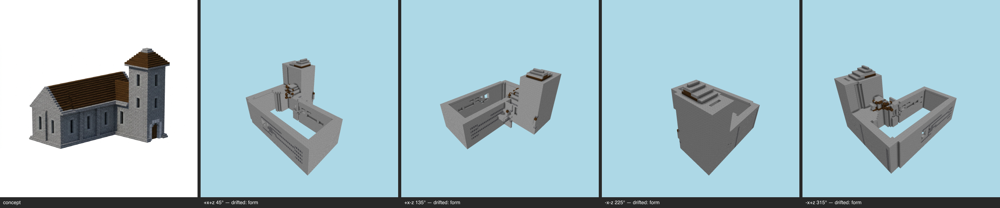

# Multi-angle same-object gate — church (generated) — T-093-01

**The sheet is the verdict artifact** (E-25 Rule 1); this table is support.

Artifact: `benchmarks/sculpture/generated/church/artifact.json` (sha256 `77409a8613aa…`) · zones: concept · contract: +x+z, +x-z, -x-z, -x+z @ 30°, 512², coverage ≥ 0.5, gap budget 2

| view | azimuth | rendered | T-088 coverage | judge verdict |
|---|---|---|---|---|
| +x+z | 45° | yes | pass | drifted major form @ nave roof (entire upper structure) major material zoning @ whole building wall vs roof minor form @ tower cap at back |
| +x-z | 135° | yes | pass | drifted major form @ main hall and tower roof major material zoning @ roof across whole structure minor massing @ nave body, open hollow shell |
| -x-z | 225° | yes | pass | drifted major form @ roof across the whole structure major material zoning @ walls vs roof (whole build) minor massing @ tower at the right end |
| -x+z | 315° | yes | pass | drifted major form @ entire roof / top of nave and tower major material zoning @ whole structure (walls vs roof) minor form @ tower cap at near corner |

## Resemblance aggregate (T-093)
**FAIL** — gaps 12/2; failures: +x+z:drifted, +x-z:drifted, -x-z:drifted, -x+z:drifted

## Kit presence (T-100)
**PASS** — every kit entry present at its grammar sites

Skips (recorded): panel:band0 (no-candidate); course (no-candidate); openings:infill (kit names no treatment for this slot); openings:shutters (kit names no treatment for this slot); openings:door (no door-kind aperture declared by the concept (T-099 D7 — detector gap, not absence))

## Kit-aware verdict
**FAIL** — resemblance fail ∧ kit presence pass (the judge cannot pass a build missing kit entries; the kit check cannot replace the judgement)
