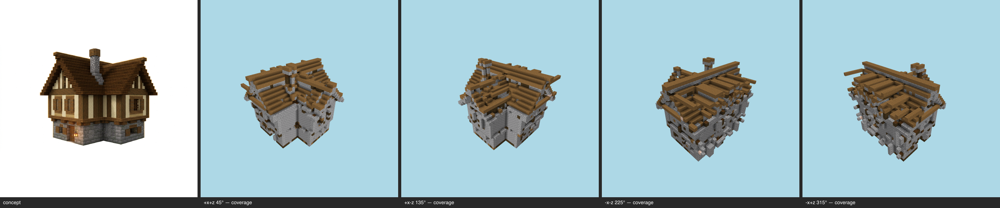

# Multi-angle same-object gate — cottage (baseline) — T-093-01

**The sheet is the verdict artifact** (E-25 Rule 1); this table is support.

Artifact: `benchmarks/sculpture/concept-materials/cottage/after-artifact.json` (sha256 `507c11918dc7…`) · zones: concept · contract: +x+z, +x-z, -x-z, -x+z @ 30°, 512², coverage ≥ 0.5, gap budget 2

| view | azimuth | rendered | T-088 coverage | judge verdict |
|---|---|---|---|---|
| +x+z | 45° | yes | band0 stone_bricks=0.581 band1 white_terracotta=0 roof dark_oak_planks=0.009 | (judge not called — coverage) |
| +x-z | 135° | yes | band0 stone_bricks=0.628 band1 white_terracotta=0 roof dark_oak_planks=0.002 | (judge not called — coverage) |
| -x-z | 225° | yes | band0 stone_bricks=0.56 band1 white_terracotta=0 roof dark_oak_planks=0.002 | (judge not called — coverage) |
| -x+z | 315° | yes | band0 stone_bricks=0.558 band1 white_terracotta=0 roof dark_oak_planks=0.002 | (judge not called — coverage) |

## Aggregate
**FAIL** — gaps 0/2; failures: +x+z:coverage, +x-z:coverage, -x-z:coverage, -x+z:coverage
