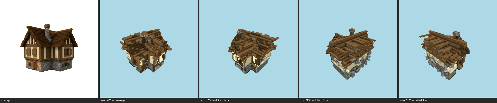

# Multi-angle same-object gate — cottage (current) — T-093-01

**The sheet is the verdict artifact** (E-25 Rule 1); this table is support.

Artifact: `benchmarks/sculpture/durable-skin/cottage/artifact.json` (sha256 `e33d48e82b07…`) · zones: concept · contract: +x+z, +x-z, -x-z, -x+z @ 30°, 512², coverage ≥ 0.5, gap budget 2

| view | azimuth | rendered | T-088 coverage | judge verdict |
|---|---|---|---|---|
| +x+z | 45° | yes | band0 tuff=0.556 band1 smooth_sandstone=0.388 roof spruce_planks=0.634 | (judge not called — coverage) |
| +x-z | 135° | yes | pass | drifted major form @ roof — eaves and ridge across the whole upper mass major massing @ roof overhang at the gable/eaves edges minor material zoning @ upper-storey timber-frame walls hidden under the splayed roof |
| -x-z | 225° | yes | pass | drifted major form @ roof minor material zoning @ upper walls under the eaves minor massing @ chimney at the ridge |
| -x+z | 315° | yes | pass | drifted major form @ roof minor material zoning @ white plaster upper storey under the eaves minor massing @ overall roof bulk vs walls |

## Resemblance aggregate (T-093)
**FAIL** — gaps 9/2; failures: +x+z:coverage, +x-z:drifted, -x-z:drifted, -x+z:drifted

## Kit presence (T-100)
**FAIL** — named absences:
- `missing: spruce_planks frame @ 192/321 frame-line cells`
- `missing: spruce_fence infill @ openings 1/2/3/4/5/6`
- `missing: spruce_trapdoor shutters @ openings 1/2/3/4/5/6`

Skips (recorded): openings:door (no door-kind aperture declared by the concept (T-099 D7 — detector gap, not absence)); openings:light (no door-kind aperture declared by the concept (T-099 D7 — detector gap, not absence))

## Kit-aware verdict
**FAIL** — resemblance fail ∧ kit presence fail (the judge cannot pass a build missing kit entries; the kit check cannot replace the judgement)
