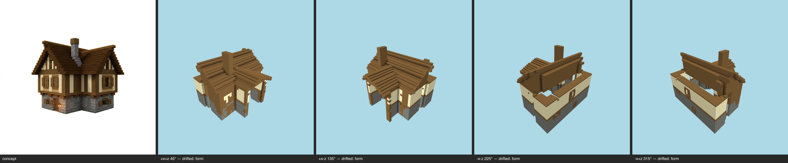

# Multi-angle same-object gate — cottage (generated) — T-093-01

**The sheet is the verdict artifact** (E-25 Rule 1); this table is support.

Artifact: `benchmarks/sculpture/generated/cottage/artifact.json` (sha256 `5edf5892b938…`) · zones: concept · contract: +x+z, +x-z, -x-z, -x+z @ 30°, 512², coverage ≥ 0.5, gap budget 2

| view | azimuth | rendered | T-088 coverage | judge verdict |
|---|---|---|---|---|
| +x+z | 45° | yes | pass | drifted major form @ main roof minor material zoning @ upper timber-framed walls minor massing @ eaves and roof overhang |
| +x-z | 135° | yes | pass | drifted major form @ main roof minor massing @ eaves/roof overhang along the long wall minor material zoning @ upper timber-framed walls |
| -x-z | 225° | yes | pass | drifted major form @ main roof major massing @ roof eaves and ridge — open gaps exposing interior minor material zoning @ upper timber-framed storey |
| -x+z | 315° | yes | pass | drifted major form @ main roof major massing @ roof ridge/eaves enclosure minor material zoning @ upper timber-framed walls |

## Resemblance aggregate (T-093)
**FAIL** — gaps 12/2; failures: +x+z:drifted, +x-z:drifted, -x-z:drifted, -x+z:drifted

## Kit presence (T-100)
**PASS** — every kit entry present at its grammar sites

## Kit-aware verdict
**FAIL** — resemblance fail ∧ kit presence pass (the judge cannot pass a build missing kit entries; the kit check cannot replace the judgement)
