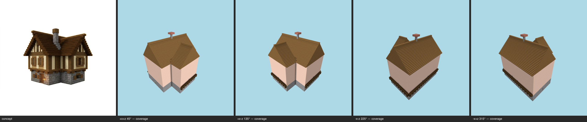

# Multi-angle same-object gate — cottage (patternbook) — T-093-01

**The sheet is the verdict artifact** (E-25 Rule 1); this table is support.

Artifact: `benchmarks/sculpture/workshop/cottage/final-artifact.json` (sha256 `3674856616af…`) · zones: concept · contract: +x+z, +x-z, -x-z, -x+z @ 30°, 512², coverage ≥ 0.5, gap budget 2

| view | azimuth | rendered | T-088 coverage | judge verdict |
|---|---|---|---|---|
| +x+z | 45° | yes | band0 stone_bricks=0.398 band1 white_terracotta=1 roof spruce_planks=1 | (judge not called — coverage) |
| +x-z | 135° | yes | band0 stone_bricks=0.41 band1 white_terracotta=1 roof spruce_planks=1 | (judge not called — coverage) |
| -x-z | 225° | yes | band0 stone_bricks=0.451 band1 white_terracotta=1 roof spruce_planks=1 | (judge not called — coverage) |
| -x+z | 315° | yes | band0 stone_bricks=0.437 band1 white_terracotta=1 roof spruce_planks=1 | (judge not called — coverage) |

## Resemblance aggregate (T-093)
**FAIL** — gaps 0/2; failures: +x+z:coverage, +x-z:coverage, -x-z:coverage, -x+z:coverage

## Kit presence (T-100)
**FAIL** — named absences:
- `missing: spruce_planks frame @ 163/456 frame-line cells`
- `missing: stone_bricks panel @ band0 (1135 cells)`

Skips (recorded): openings (no concept-declared apertures supplied)

## Kit-aware verdict
**FAIL** — resemblance fail ∧ kit presence fail (the judge cannot pass a build missing kit entries; the kit check cannot replace the judgement)
