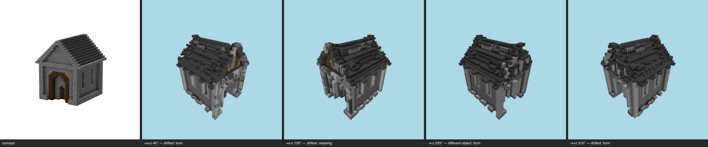

# Multi-angle same-object gate — gatehouse (current) — T-093-01

**The sheet is the verdict artifact** (E-25 Rule 1); this table is support.

Artifact: `benchmarks/sculpture/durable-skin/gatehouse/artifact.json` (sha256 `e59d9a2c477d…`) · zones: concept · contract: +x+z, +x-z, -x-z, -x+z @ 30°, 512², coverage ≥ 0.5, gap budget 2

| view | azimuth | rendered | T-088 coverage | judge verdict |
|---|---|---|---|---|
| +x+z | 45° | yes | pass | drifted major form @ roof / upper structure minor material zoning @ front and side walls minor massing @ overall upper silhouette vs mesh |
| +x-z | 135° | yes | pass | drifted major massing @ base perimeter and lower walls minor palette @ walls overall minor form @ front opening |
| -x-z | 225° | yes | pass | different object major form @ roof and upper mass major massing @ overall silhouette vs the clean gabled house major material zoning @ walls covered in irregular vertical ribbing and dark debris |
| -x+z | 315° | yes | pass | drifted major form @ walls / lower storey major massing @ roof crown minor palette @ overall stone-and-dark-roof scheme |

## Aggregate
**FAIL** — gaps 12/2; failures: +x+z:drifted, +x-z:drifted, -x-z:different object, -x+z:drifted
