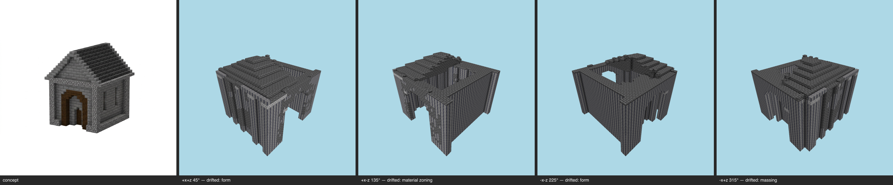

# Multi-angle same-object gate — gatehouse (generated) — T-093-01

**The sheet is the verdict artifact** (E-25 Rule 1); this table is support.

Artifact: `benchmarks/sculpture/generated/gatehouse/artifact.json` (sha256 `80c904c7861f…`) · zones: concept · contract: +x+z, +x-z, -x-z, -x+z @ 30°, 512², coverage ≥ 0.5, gap budget 2

| view | azimuth | rendered | T-088 coverage | judge verdict |
|---|---|---|---|---|
| +x+z | 45° | yes | pass | drifted major form @ entire roof / top of structure major material zoning @ walls vs roof across the whole building minor form @ front doorway / arched entrance |
| +x-z | 135° | yes | pass | drifted major material zoning @ whole structure — walls versus roof major form @ roof and upper body of the building minor form @ front entrance wall |
| -x-z | 225° | yes | pass | drifted major form @ roof / entire top of the structure major material zoning @ walls vs roof across the whole building minor palette @ upper wall courses near the eaves |
| -x+z | 315° | yes | pass | drifted major massing @ roof / top of the building major form @ all four walls minor material zoning @ front entrance |

## Resemblance aggregate (T-093)
**FAIL** — gaps 12/2; failures: +x+z:drifted, +x-z:drifted, -x-z:drifted, -x+z:drifted

## Kit presence (T-100)
**PASS** — every kit entry present at its grammar sites

Skips (recorded): openings:door (kit names no treatment for this slot); openings:light (kit names no treatment for this slot)

## Kit-aware verdict
**FAIL** — resemblance fail ∧ kit presence pass (the judge cannot pass a build missing kit entries; the kit check cannot replace the judgement)
