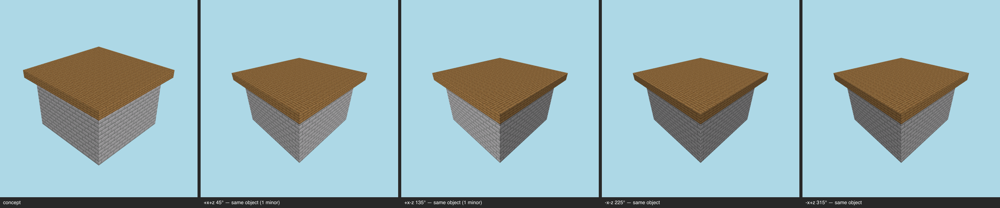

# Multi-angle same-object gate — synthetic-hut (current) — T-093-01

**The sheet is the verdict artifact** (E-25 Rule 1); this table is support.

Artifact: `benchmarks/sculpture/multi-angle/fixtures/hut/artifact.json` (sha256 `0db4c89694f9…`) · zones: concept · contract: +x+z, +x-z, -x-z, -x+z @ 30°, 512², coverage ≥ 0.5, gap budget 2

| view | azimuth | rendered | T-088 coverage | judge verdict |
|---|---|---|---|---|
| +x+z | 45° | yes | pass | same object minor massing @ roof overhang depth |
| +x-z | 135° | yes | pass | same object minor form @ roof overhang front edge |
| -x-z | 225° | yes | pass | same object |
| -x+z | 315° | yes | pass | same object |

## Aggregate
**PASS** — gaps 2/2
