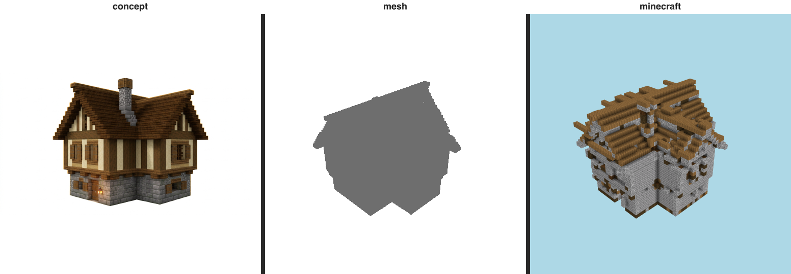

# Resemblance gate — cottage (T-076-01)

The E-22 gate: does the build LOOK LIKE its immutable references? The **triptych is the verdict a human
inspects** (Rule 2); the perceptual numbers below only EXPLAIN it.

## Triptych (the verdict) — `concept | mesh | minecraft` (labeled)

  `benchmarks/sculpture/resemblance/cottage-triptych.png`

## Categorical judge (metered)

- **verdict:** `drifted`
- **named gap (Rule 7):** **material zoning** — _upper-story walls below the roof_
- **rationale:** The lower stone base and brown plank roof read as the same cottage, but the concept's distinctive cream half-timbered upper story is rendered as gray stone, collapsing the two-tone wall zoning into a single stone mass.

## Perceptual diagnostics (Rule 2 — NOT the verdict)

| axis | value | reads against |
| ---- | ----- | ------------- |
| form IoU (vs mesh) | 0.929 | the 3-D form reference |
| form IoU (vs concept) | 0.63 | the concept (approx. 3/4 view) |
| material set agreement | 0.667 | same materials at all? (0..1) |
| material zone agreement | 0.321 | materials in the same places? (0..1) |
| mean zone ΔE | 36.43 | per-cell Lab drift (lower better) |

Build dominant blocks: stone_bricks×3933, spruce_planks×1073, dark_oak_log×785, cobblestone×608, dark_oak_planks×22, white_terracotta×8.
Concept snapped blocks: gray_terracotta, cartography_table, polished_diorite, white_stained_glass, crafting_table, white_stained_glass.

> Honesty: concept is an APPROXIMATE 3/4 view (camera mismatch depresses IoU/zone ΔE); zoning is read
> from render pixels, not 3-D block positions. These are diagnostic — the triptych + judge are the verdict.
