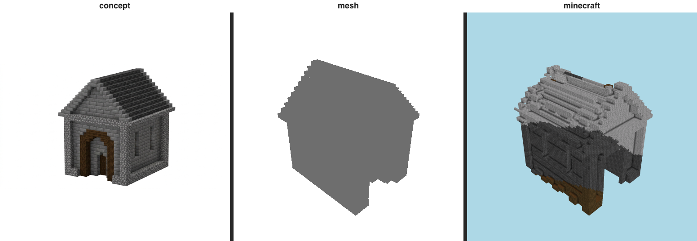

# Resemblance gate — gatehouse (T-076-01)

The E-22 gate: does the build LOOK LIKE its immutable references? The **triptych is the verdict a human
inspects** (Rule 2); the perceptual numbers below only EXPLAIN it.

## Triptych (the verdict) — `concept | mesh | minecraft` (labeled)

  `benchmarks/sculpture/resemblance/gatehouse-triptych.png`

## Categorical judge (metered)

- **verdict:** `drifted`
- **named gap (Rule 7):** **form** — _upper roof and gable_
- **rationale:** The lower stone walls and warm arched door read as the same gatehouse, but the upper region lacks a clean pitched roof and dissolves into a noisy lighter mass.

## Perceptual diagnostics (Rule 2 — NOT the verdict)

| axis | value | reads against |
| ---- | ----- | ------------- |
| form IoU (vs mesh) | 0.929 | the 3-D form reference |
| form IoU (vs concept) | 0.611 | the concept (approx. 3/4 view) |
| material set agreement | 0.75 | same materials at all? (0..1) |
| material zone agreement | 0.304 | materials in the same places? (0..1) |
| mean zone ΔE | 39.27 | per-cell Lab drift (lower better) |

Build dominant blocks: stone_bricks×33158, deepslate_tiles×18261, cobblestone×3789, dark_oak_log×1994.
Concept snapped blocks: gilded_blackstone, deepslate_bricks, deepslate_copper_ore, iron_block, white_stained_glass, white_stained_glass.

> Honesty: concept is an APPROXIMATE 3/4 view (camera mismatch depresses IoU/zone ΔE); zoning is read
> from render pixels, not 3-D block positions. These are diagnostic — the triptych + judge are the verdict.
