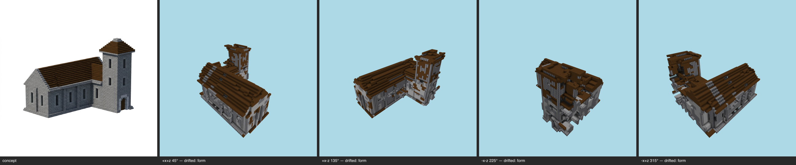

# Styled milestone — church (T-101-01, E-26 terminal)

One command, the whole E-26 chain: kit (committed, T-096) → shell integrity (T-091) → regularize (T-102 cage) → skin (T-086 value-true → kit overrides → seal → T-092 zones → T-090 fill → T-087 coherence → T-088 gates) → placement grammar (T-098) → opening dressing (T-099) → grammar settle (the T-100 fixpoint seam) → kit-aware multi-angle gate (T-100 ∘ T-093). **Reproducible**: double-run byte-identical, styled sha256 `7275e77ba9e704ed…`.

## Provision (challenge subject)
Scale 48, 11423 cells, 4 manifest blocks — GLB + committed material map, zero tuning.

## Shell integrity (T-091)
Strip 70 → 3 components (505 cells); voids 1992 filled; plug 737 cells / 1 iter → **CLOSED**. Openings honored: window, window, window, window, window, window, window, window, window, window, window, window, window, window, window, window, window, window, window, window, window, window, window, window, window, window, window, window.

## Skin (T-086/T-096/T-092/T-090/T-087/T-088)
Zone map: **concept** — band0 y0..16 `cobblestone`; roof `dark_oak_planks`. Substitution `{"cobblestone":"stone","stone_bricks":"polished_basalt"}`; kit overrides `{}`. Fill 1968; salt 324 stripped. Coverage gate **final PASS** — band0 `stone` 31% · band0:offslab `null` ? · roof `dark_oak_planks` 79%.

## Placement grammar (T-098)
Frame `polished_basalt`: 162 painted, 7 adopted, 46 respected, 6 isolates skipped, 315 already; fill 37 / kept 9454; **frameRefilled 0** (survival proof); coverage + band evidence re-asserted PASS.

## Opening dressing (T-099)
38 concept-declared apertures; 34 placements (0/38 fully dressed, 129 conflicts, 0 already dressed). Unfulfilled slots: infill (no kit entry routes to this slot), shutter (no kit entry routes to this slot), light (no kit entry routes to this slot). Derivations: none.
Settle (the T-100 seam): grammar re-run to its own fixpoint in 1 iteration(s) (frame 1 + foreign fill 0 + gating dressing 0) — the styled build is a no-op for the op the kit-presence checker re-runs.

## Kit-aware multi-angle gate (T-100 ∘ T-093) — **FAIL**

Resemblance: FAIL (gaps 12/2) · Kit presence: PASS (zero gaps)

| view | azimuth | coverage | verdict | gaps |
|---|---|---|---|---|
| +x+z | 45° | pass | drifted | major form@main nave roof across the whole ridge; minor form@tower cap at the right; minor palette@stone walls and roof coloring |
| +x-z | 135° | pass | drifted | major form@roof over the whole nave and tower; major palette@nave and tower walls; minor massing@right-end tower massing |
| -x-z | 225° | pass | drifted | major form@whole roof across the top; major massing@right-hand end of the building body; minor palette@walls and roof stonework |
| -x+z | 315° | pass | drifted | major form@roof along the whole nave and tower cap; major massing@upper tower / ridge junction; minor palette@stone walls and brown roof color |

Gate record: `benchmarks/sculpture/multi-angle/church-styled.json` (the sheet is the verdict artifact).

## Evidence
Frames: pr/assets/frames/styled-church-after.png; kit report `pr/assets/styled-church-kit.md`.

> kit→shell→skin→grammar→dressing is a pure function of the committed inputs (concept PNG, material map, GLB, kit); two in-process executions byte-matched on every artifact; --repro re-proves from a fresh process. LLM-authored inputs are one-time committed records (the kit's raw model reply is pinned beside it); the gate judge is the pinned model, single sample per view, verdicts committed in the gate record.
