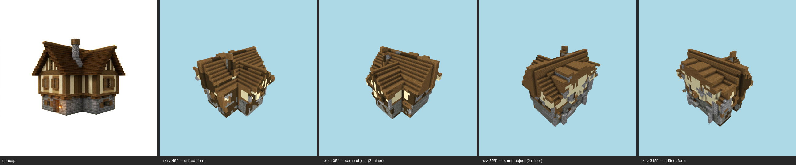

# Styled milestone — cottage (T-101-01, E-26 terminal)

One command, the whole E-26 chain: kit (committed, T-096) → shell integrity (T-091) → regularize (T-102 cage) → skin (T-086 value-true → kit overrides → seal → T-092 zones → T-090 fill → T-087 coherence → T-088 gates) → placement grammar (T-098) → opening dressing (T-099) → grammar settle (the T-100 fixpoint seam) → kit-aware multi-angle gate (T-100 ∘ T-093). **Reproducible**: double-run byte-identical, styled sha256 `8385a7a357252732…`.

## Shell integrity (T-091)
Strip 24 → 1 components (156 cells); voids 958 filled; plug 462 cells / 1 iter → **CLOSED**. Openings honored: window, window, window, window, window, window, window, window.

## Skin (T-086/T-096/T-092/T-090/T-087/T-088)
Zone map: **concept** — band0 y0..7 `stone_bricks`, band1 y8..18 `white_terracotta`; roof `dark_oak_planks`. Substitution `{"stone_bricks":"tuff","white_terracotta":"sandstone"}`; kit overrides `{"white_terracotta":"smooth_sandstone","dark_oak_planks":"spruce_planks"}`. Fill 849; salt 243 stripped. Coverage gate **final PASS** — band0 `tuff` 68% · band0:offslab `null` ? · band1 `smooth_sandstone` 51% · band1:offslab `null` ? · roof `spruce_planks` 92%.

## Placement grammar (T-098)
Frame `spruce_planks`: 320 painted, 11 adopted, 123 respected, 14 isolates skipped, 53 already; fill 5 / kept 3765; **frameRefilled 0** (survival proof); coverage + band evidence re-asserted PASS.

## Opening dressing (T-099)
6 concept-declared apertures; 36 placements (2/6 fully dressed, 7 conflicts, 0 already dressed). Unfulfilled slots: none. Derivations: [{"slot":"infill","block":"spruce_fence","from":"spruce_trapdoor","reason":"no rail entry in kit; species-matched fence derived from the shutter block (the kit declared the window grille unidentified)"}].
Settle (the T-100 seam): grammar re-run to its own fixpoint in 1 iteration(s) (frame 3 + fill 1) — the styled build is a no-op for the op the kit-presence checker re-runs.

## Kit-aware multi-angle gate (T-100 ∘ T-093) — **FAIL**

Resemblance: FAIL (gaps 10/2) · Kit presence: PASS (zero gaps)

| view | azimuth | coverage | verdict | gaps |
|---|---|---|---|---|
| +x+z | 45° | pass | drifted | major form@roof and upper storey; minor massing@overall silhouette vs. clean gabled mesh; minor material zoning@stone base relative to cream wall band |
| +x-z | 135° | pass | same object | minor form@roof ridge and upper massing; minor massing@chimney on the roof |
| -x-z | 225° | pass | same object | minor form@roof ridge and eaves; minor massing@chimney on roof |
| -x+z | 315° | pass | drifted | major form@roof and upper massing; minor massing@overall silhouette versus mesh; minor material zoning@stone base at lower right |

Gate record: `benchmarks/sculpture/multi-angle/cottage-styled.json` (the sheet is the verdict artifact).

## Evidence
Frames: pr/assets/frames/styled-cottage-before.png, pr/assets/frames/styled-cottage-after.png; kit report `pr/assets/styled-cottage-kit.md`.

> kit→shell→skin→grammar→dressing is a pure function of the committed inputs (concept PNG, material map, GLB, kit); two in-process executions byte-matched on every artifact; --repro re-proves from a fresh process. LLM-authored inputs are one-time committed records (the kit's raw model reply is pinned beside it); the gate judge is the pinned model, single sample per view, verdicts committed in the gate record.
