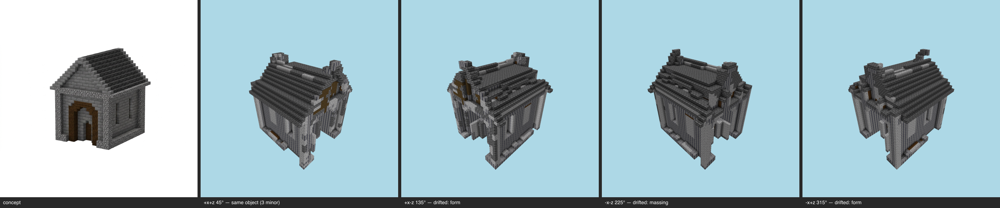

# Styled milestone — gatehouse (T-101-01, E-26 terminal)

One command, the whole E-26 chain: kit (committed, T-096) → shell integrity (T-091) → regularize (T-102 cage) → skin (T-086 value-true → kit overrides → seal → T-092 zones → T-090 fill → T-087 coherence → T-088 gates) → placement grammar (T-098) → opening dressing (T-099) → grammar settle (the T-100 fixpoint seam) → kit-aware multi-angle gate (T-100 ∘ T-093). **Reproducible**: double-run byte-identical, styled sha256 `e3b89444f3a5365b…`.

## Shell integrity (T-091)
Strip 23 → 3 components (221 cells); voids 820 filled; plug 54 cells / 1 iter → **CLOSED**. Openings honored: window, window, door, window, window, door.

## Skin (T-086/T-096/T-092/T-090/T-087/T-088)
Zone map: **concept** — band0 y0..22 `stone_bricks`; roof `deepslate_tiles`. Substitution `{"stone_bricks":"polished_basalt"}`; kit overrides `{"deepslate_tiles":"deepslate_bricks"}`. Fill 79; salt 177 stripped. Coverage gate **final PASS** — band0 `polished_basalt` 70% · band0:offslab `null` ? · roof `deepslate_bricks` 87%.

## Placement grammar (T-098)
Frame `cobblestone`: 270 painted, 11 adopted, 75 respected, 11 isolates skipped, 16 already; fill 5 / kept 4261; **frameRefilled 0** (survival proof); coverage + band evidence re-asserted PASS.

## Opening dressing (T-099)
12 concept-declared apertures; 72 placements (0/12 fully dressed, 43 conflicts, 0 already dressed). Unfulfilled slots: infill (no kit entry routes to this slot), shutter (no kit entry routes to this slot), door (no kit entry routes to this slot), light (no kit entry routes to this slot). Derivations: none.
Settle (the T-100 seam): grammar re-run to its own fixpoint in 0 iteration(s) (already a no-op) — the styled build is a no-op for the op the kit-presence checker re-runs.

## Kit-aware multi-angle gate (T-100 ∘ T-093) — **FAIL**

Resemblance: FAIL (gaps 12/2) · Kit presence: PASS (zero gaps)

| view | azimuth | coverage | verdict | gaps |
|---|---|---|---|---|
| +x+z | 45° | pass | same object | minor form@roof ridge and corner caps; minor material zoning@right-hand wall brown timber strip; minor form@upper roof slope edges |
| +x-z | 135° | pass | drifted | major form@roof ridge and eaves; major massing@overall building silhouette; minor material zoning@stone walls and timber accents |
| -x-z | 225° | pass | drifted | major massing@overall building outline and roofline; major form@front facade — colonnade/pillars instead of a single arched doorway; minor form@roof ridge and gable |
| -x+z | 315° | pass | drifted | major form@roofline and ridge; major massing@left side / upper corner, vertical posts protruding above the roof; minor palette@overall stone walls and dark roof |

Gate record: `benchmarks/sculpture/multi-angle/gatehouse-styled.json` (the sheet is the verdict artifact).

## Evidence
Frames: pr/assets/frames/styled-gatehouse-before.png, pr/assets/frames/styled-gatehouse-after.png; kit report `pr/assets/styled-gatehouse-kit.md`.

> kit→shell→skin→grammar→dressing is a pure function of the committed inputs (concept PNG, material map, GLB, kit); two in-process executions byte-matched on every artifact; --repro re-proves from a fresh process. LLM-authored inputs are one-time committed records (the kit's raw model reply is pinned beside it); the gate judge is the pinned model, single sample per view, verdicts committed in the gate record.
