# Temple-facade benchmark

The project's single design benchmark: *"design the full-quality facade of a **temple**"*,
photographed **head-on**.

Why this shape:
- **Facade, not a full build** — bounded scope, so the model pours detail into one face and
  it generates in **one short call** (the multi-phase full-build runs were 30+ min).
- **Frontal shot** — a fixed head-on camera makes runs **directly comparable**.
- **Open style + color** — earlier runs collapsed into bare white quartz when a classical
  style was insisted on, so the task invites an *invented* style and a deliberately colorful
  palette.

The task (`task.mjs`: goal, orientation contract, frontal view, seed) is held constant; the
approach varies and labels each run.

## Run it

```bash
# LIVE & METERED — claude -p subscription (spec §4)
npm run bench:temple-facade -- --approach <label> --note "what changed"
```

Output in `runs/<NNN-approach>/`: `render.png` (the frontal shot), `artifact.json`,
`summary.json`, `prompt.txt` (transcript saved but git-ignored). The gallery regenerates
automatically.

## Approaches

- **`v0-facade`** — single-shot; uncapped, color-inviting prompt + orientation contract.
- **`v1-multimodal`** — draft → render head-on → critique prompt → re-emit improved (2 calls).
- **`v2-designdoc`** — write a finalized design document (lore, architectural rationale,
  color-theory palette, motifs, features), then build from it (2 calls).
- **`v3-designdoc-revise`** — `v2` plus an *identity-preserving* multimodal revision that tightens
  geometry/proportion while honoring the document's palette and concept (3 calls).

**Learnings** — what works and what doesn't is tracked in
[`docs/knowledge/design-learnings.md`](../../docs/knowledge/design-learnings.md) (the
auto-injected corpus). Review and update it after each run.

## Progression

<!-- RUNS:START (generated by run.mjs — do not edit by hand) -->

| # | date | approach | score | blocks | tok in/out | $ | wall | note |
|---|------|----------|-------|--------|-----------|---|------|------|
| 1 | 2026-06-04 | `v0-facade` | 4 | 2908 | 9841/26219 | $0.7602 | — | baseline: open style + color, frontal shot |
| 2 | 2026-06-04 | `v1-multimodal` | 4 | 1820 | 19830/59460 | $1.6926 | — | draft + 1 visual-feedback revision |
| 3 | 2026-06-04 | `v2-designdoc` | 3 | 1372 | 19767/35588 | $1.0759 | — | design-document-first: lore + architectural rationale + color-theory palette, then build |
| 4 | 2026-06-04 | `v3-designdoc-revise` | 3 | 959 | 29639/60139 | $1.7982 | — | design-doc + identity-preserving multimodal revision (P3+P4) |
| 5 | 2026-06-04 | `vN-bestof` | 3.67 | 2273 | 126140/124371 | $5.3415 | 1727s | best-of-4 design-doc, judge-selected (test: does selection break the 3-4 plateau?) |
| 6 | 2026-06-04 | `v4-designdoc-highres` | 4 | 9376 | 20476/28875 | $0.9124 | 407s | design-doc + HIGH-RES build: lift relief/scale caps, require deep relief + proportioned crown (vs v2 capped) |
| 7 | 2026-06-05 | `v5-designdoc-detail` | 3.33 | 6985 | 21752/34687 | $1.0661 | 448s | v4 high-res + hard surface-detail push (retry-on-malformed enabled) |
| 8 | 2026-06-05 | `vRef-designdoc` | 4 | 20311 | 21837/34157 | $1.6368 | 490s | design doc grounded in Sun Yat-sen Mausoleum reference (JPEG), then v4 high-res build |
| 9 | 2026-06-04 | `vRef-designdoc` | strong | 24596 | 0/0 | $0.0000 | — | Arc de Triomphe; salvaged (run errored at summary step after a build-narration retry) |
| 10 | 2026-06-05 | `vRefRevise-designdoc` | competent | 10566 | 30759/73003 | $2.0924 | 1697s | Taj Mahal; 2nd pass compares build to reference; both build seams retries=2 |
| 13 | 2026-06-05 | `vRefRevise-designdoc` | competent | 10448 | 30771/57236 | $1.7645 | 818s |  |
| 14 | 2026-06-05 | `vRefRevise-designdoc` | strong | 10013 | 30745/52174 | $1.6413 | 1100s |  |
| 15 | 2026-06-05 | `vRefRevise-designdoc` | strong | 10955 | 30610/67528 | $2.0255 | 919s |  |
| 16 | 2026-06-05 | `vRefRevise-designdoc` | strong | 17710 | 30167/66094 | $1.9910 | 910s |  |
| 17 | 2026-06-05 | `vRefRevise-designdoc` | strong | 6541 | 32907/62901 | $1.9257 | 852s |  |
| 18 | 2026-06-05 | `vRefRevise-designdoc` | strong | 6533 | 31643/53789 | $1.6927 | 1075s | T-010-01 detail lever B: contrast-preserving block-texture grain (vs S-006 relief panels) |
| 19 | 2026-06-05 | `vRefRevise-designdoc` | strong | 4953 | 31809/47581 | $1.5248 | 688s | Horyu-ji generalization (T-007-01): P12/P13 stress on a wooden pagoda — near-monochrome timber palette, freestanding stacked-tier tower |
| 20 | 2026-06-05 | `vRefRevise-designdoc` | competent | 4068 | 33106/66402 | $2.0190 | 929s | Sainte-Chapelle generalization (T-008-01): inverse P12 test (ref intended colorful); but provided image is grey-limestone EXTERIOR. Read: did color come out strong regardless? + Gothic verticality on proportion (P13), tracery on detail (S-006). |
| 21 | 2026-06-05 | `vRefRevise-designdoc` | strong | 12696 | 30973/71671 | $2.1251 | 1006s | Arc de Triomphe generalization (T-011-01): single colossal opening; tests P12 color off a 4th pale ref, P13 proportion on arch massing, and the detail lever on the broad flat attic/spandrel fields. |
| 22 | 2026-06-05 | `vRefRevise-designdoc` | strong | 11325 | 32038/42093 | $1.4054 | 640s | Sun Yat-sen Mausoleum re-run (T-012-01): cumulative-progress on the reference that first proved grounding (run 008). P12 on a blue-white reference; P13 on double-eaved stacked roof + battered wings; detail lever vs 008's named blank base register + shallow portico. |
| 23 | 2026-06-05 | `vRefRevise-designdoc` | strong | 5196 | 32634/58118 | $1.8112 | 830s | persona A/B OFF (T-013-01): champion default, no system prompt |
| 24 | 2026-06-05 | `vRefRevise-designdoc` | strong | 9500 | 32558/53970 | $1.7084 | 723s | T-009-01 effort A/B: DEFAULT (no --effort) |
| 25 | 2026-06-05 | `vRefRevise-designdoc` | strong | 8614 | 32916/71370 | $2.1818 | 980s | persona A/B ON (T-013-01): master-architect system prompt across all 3 stages |
| 26 | 2026-06-05 | `vRefRevise-designdoc` | strong | 8802 | 32855/71208 | $2.1434 | 946s | T-009-01 effort A/B: HIGH (--effort high) |
| 27 | 2026-10-08 | `vRefRevise-designdoc` | strong | 23467 | 34/93811 | $3.3571 | 881s | opus-5-5 rerun of 014 (judge pinned opus-4-8) |
| 28 | 2026-10-08 | `v0-facade` | strong | 2319 | 2/24022 | $0.7797 | 275s | opus-5-5 rerun of 001 (judge pinned opus-4-8) |
| 29 | 2026-10-08 | `vRefRevise-designdoc` | strong | 19456 | 8/69409 | $2.3755 | 887s | opus-5-5 rerun of 021 (judge pinned opus-4-8) |
| 30 | 2026-10-08 | `v0-facade` | strong | 2639 | 2/22512 | $0.0188 | 165s | haiku-5-5 rerun of 001/028 (judge pinned opus-4-8) |
| 31 | 2026-10-08 | `vRefRevise-designdoc` | strong | 2819 | 6/78810 | $0.0606 | 542s | haiku-5-5 rerun of 014/027 (judge pinned opus-4-8) |
| 32 | 2026-10-08 | `vRefRevise-designdoc` | strong | 2312 | 6/75276 | $0.0580 | 412s | haiku-5-5 rerun of 021/029 (judge pinned opus-4-8) |
| 33 | 2026-10-08 | `v0-facade` | strong | 2392 | 2/14159 | $0.2924 | 168s | sonnet-5-5 (judge pinned opus-4-8) |
| 34 | 2026-10-08 | `v0-facade` | strong | 2778 | 2/28960 | $0.0220 | 197s | haiku-5-5 effort max (judge pinned opus-4-8) |
| 35 | 2026-10-08 | `vRefRevise-designdoc` | strong | 10264 | 6/54779 | $0.9718 | 435s | sonnet-5-5 Taj (judge pinned opus-4-8) |
| 36 | 2026-10-08 | `vRefRevise-designdoc` | competent | 1277 | 10/535461 | $0.3040 | 4043s | haiku-5-5 effort max Taj (judge pinned opus-4-8) |
| 37 | 2026-10-08 | `vRefRevise-designdoc` | strong | 5771 | 6/39475 | $0.8062 | 371s | sonnet-5-5 Arc (judge pinned opus-4-8) |

## Gallery

### 001 — `v0-facade` · 2026-06-04

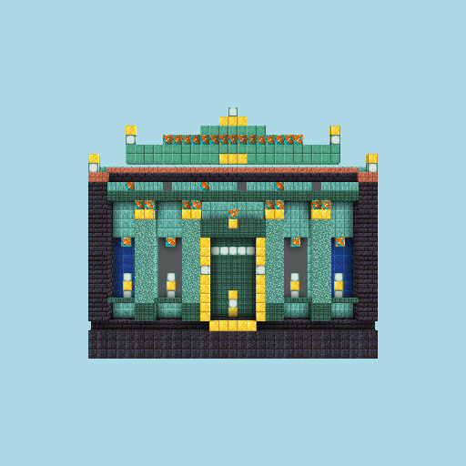

**4** · 2908 blocks · 9841/26219 tok · $0.7602

> baseline: open style + color, frontal shot

### 002 — `v1-multimodal` · 2026-06-04


**4** · 1820 blocks · 19830/59460 tok · $1.6926

> draft + 1 visual-feedback revision

### 003 — `v2-designdoc` · 2026-06-04

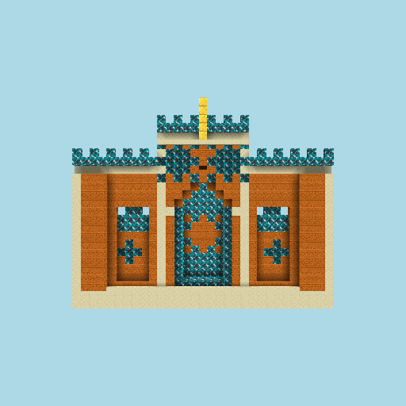

**3** · 1372 blocks · 19767/35588 tok · $1.0759

> design-document-first: lore + architectural rationale + color-theory palette, then build

### 004 — `v3-designdoc-revise` · 2026-06-04

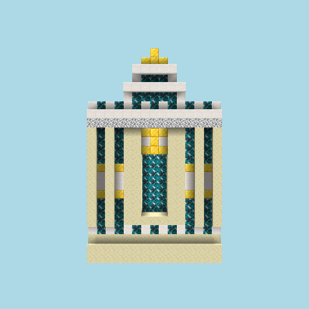

**3** · 959 blocks · 29639/60139 tok · $1.7982

> design-doc + identity-preserving multimodal revision (P3+P4)

### 005 — `vN-bestof` · 2026-06-04

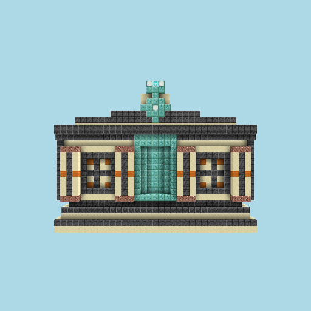

**3.67** · 2273 blocks · 126140/124371 tok · $5.3415

> best-of-4 design-doc, judge-selected (test: does selection break the 3-4 plateau?)

### 006 — `v4-designdoc-highres` · 2026-06-04

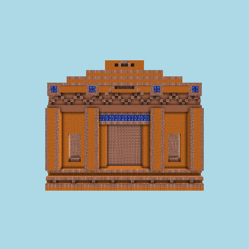

**4** · 9376 blocks · 20476/28875 tok · $0.9124

> design-doc + HIGH-RES build: lift relief/scale caps, require deep relief + proportioned crown (vs v2 capped)

### 007 — `v5-designdoc-detail` · 2026-06-05

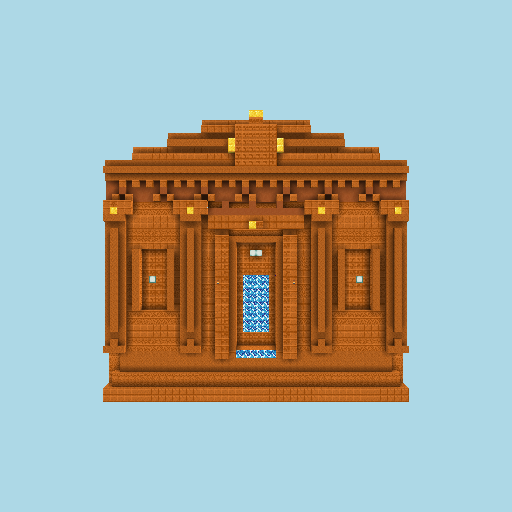

**3.33** · 6985 blocks · 21752/34687 tok · $1.0661

> v4 high-res + hard surface-detail push (retry-on-malformed enabled)

### 008 — `vRef-designdoc` · 2026-06-05

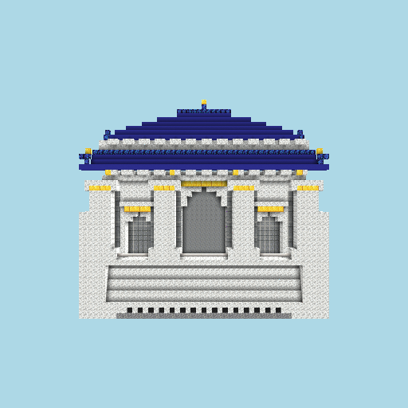

**4** · 20311 blocks · 21837/34157 tok · $1.6368

> design doc grounded in Sun Yat-sen Mausoleum reference (JPEG), then v4 high-res build

### 009 — `vRef-designdoc` · 2026-06-04

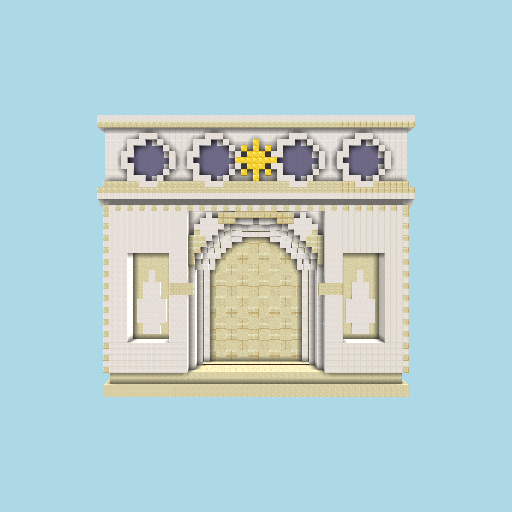

**strong** · 24596 blocks · 0/0 tok · $0.0000

> Arc de Triomphe; salvaged (run errored at summary step after a build-narration retry)

### 010 — `vRefRevise-designdoc` · 2026-06-05

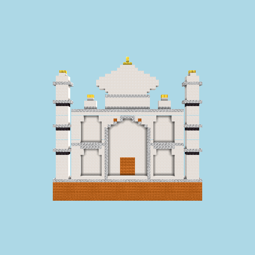

**competent** · 10566 blocks · 30759/73003 tok · $2.0924

> Taj Mahal; 2nd pass compares build to reference; both build seams retries=2

### 013 — `vRefRevise-designdoc` · 2026-06-05

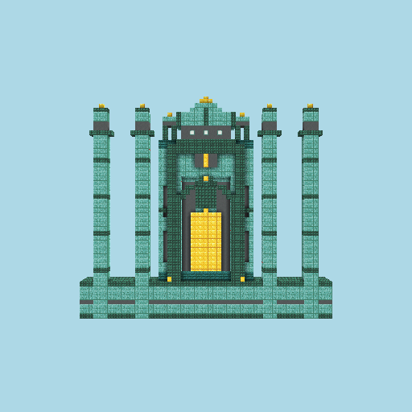

**competent** · 10448 blocks · 30771/57236 tok · $1.7645

### 014 — `vRefRevise-designdoc` · 2026-06-05

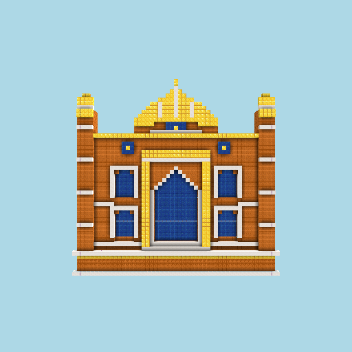

**strong** · 10013 blocks · 30745/52174 tok · $1.6413

### 015 — `vRefRevise-designdoc` · 2026-06-05

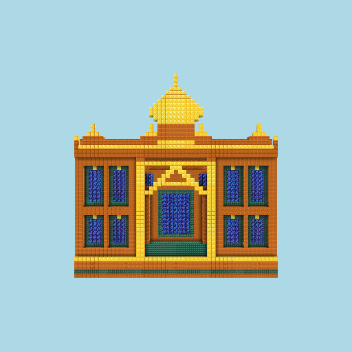

**strong** · 10955 blocks · 30610/67528 tok · $2.0255

### 016 — `vRefRevise-designdoc` · 2026-06-05

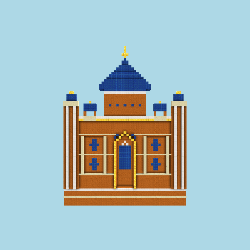

**strong** · 17710 blocks · 30167/66094 tok · $1.9910

### 017 — `vRefRevise-designdoc` · 2026-06-05

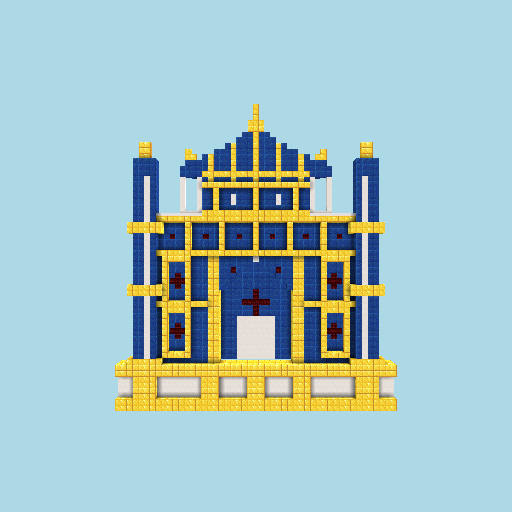

**strong** · 6541 blocks · 32907/62901 tok · $1.9257

### 018 — `vRefRevise-designdoc` · 2026-06-05

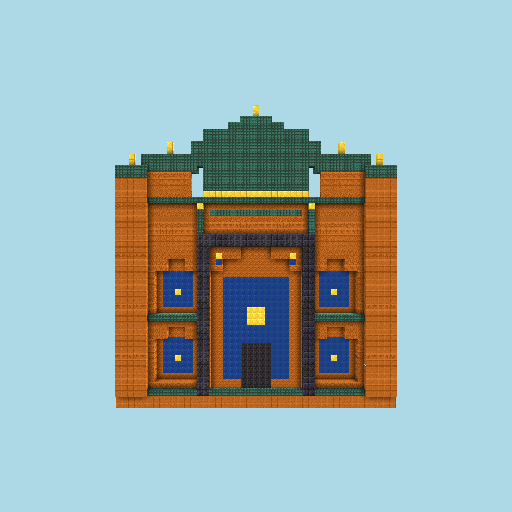

**strong** · 6533 blocks · 31643/53789 tok · $1.6927

> T-010-01 detail lever B: contrast-preserving block-texture grain (vs S-006 relief panels)

### 019 — `vRefRevise-designdoc` · 2026-06-05

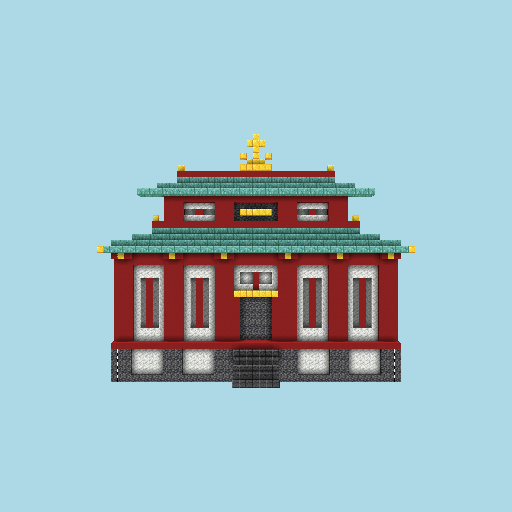

**strong** · 4953 blocks · 31809/47581 tok · $1.5248

> Horyu-ji generalization (T-007-01): P12/P13 stress on a wooden pagoda — near-monochrome timber palette, freestanding stacked-tier tower

### 020 — `vRefRevise-designdoc` · 2026-06-05

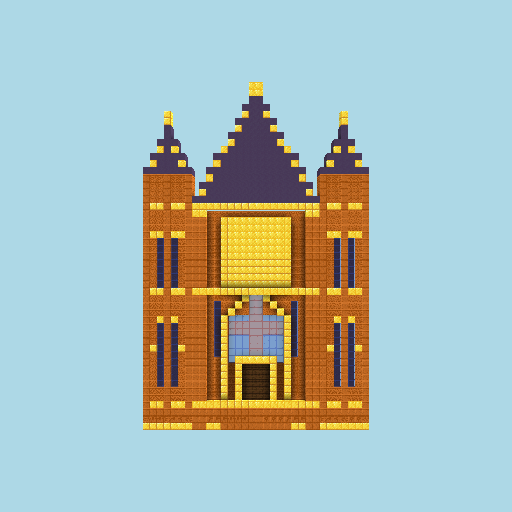

**competent** · 4068 blocks · 33106/66402 tok · $2.0190

> Sainte-Chapelle generalization (T-008-01): inverse P12 test (ref intended colorful); but provided image is grey-limestone EXTERIOR. Read: did color come out strong regardless? + Gothic verticality on proportion (P13), tracery on detail (S-006).

### 021 — `vRefRevise-designdoc` · 2026-06-05

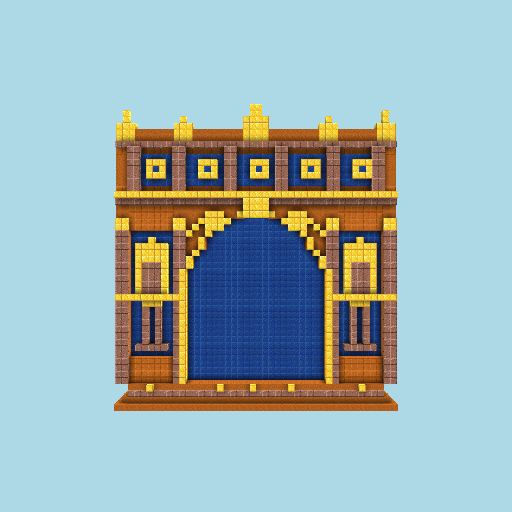

**strong** · 12696 blocks · 30973/71671 tok · $2.1251

> Arc de Triomphe generalization (T-011-01): single colossal opening; tests P12 color off a 4th pale ref, P13 proportion on arch massing, and the detail lever on the broad flat attic/spandrel fields.

### 022 — `vRefRevise-designdoc` · 2026-06-05

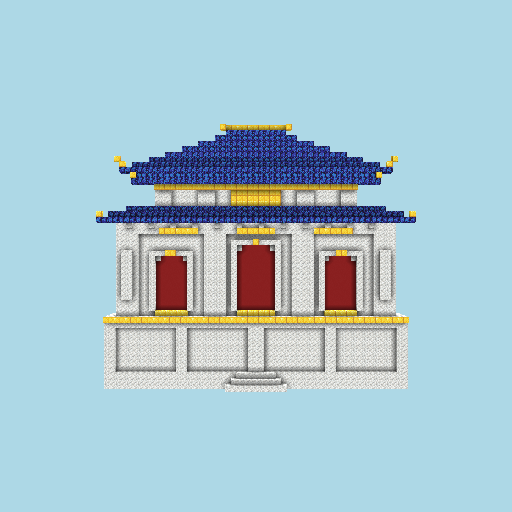

**strong** · 11325 blocks · 32038/42093 tok · $1.4054

> Sun Yat-sen Mausoleum re-run (T-012-01): cumulative-progress on the reference that first proved grounding (run 008). P12 on a blue-white reference; P13 on double-eaved stacked roof + battered wings; detail lever vs 008's named blank base register + shallow portico.

### 023 — `vRefRevise-designdoc` · 2026-06-05

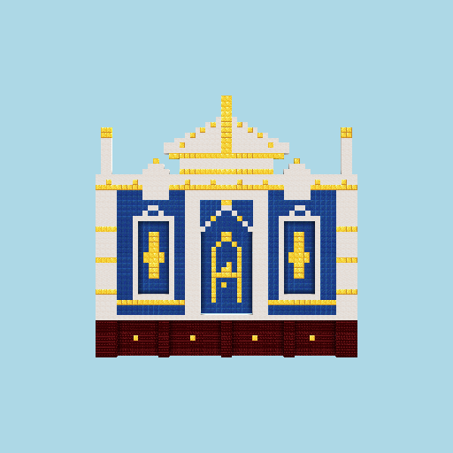

**strong** · 5196 blocks · 32634/58118 tok · $1.8112

> persona A/B OFF (T-013-01): champion default, no system prompt

### 024 — `vRefRevise-designdoc` · 2026-06-05

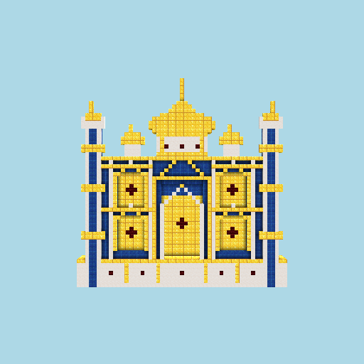

**strong** · 9500 blocks · 32558/53970 tok · $1.7084

> T-009-01 effort A/B: DEFAULT (no --effort)

### 025 — `vRefRevise-designdoc` · 2026-06-05

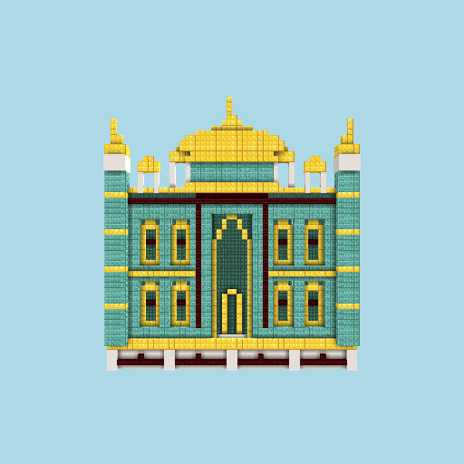

**strong** · 8614 blocks · 32916/71370 tok · $2.1818

> persona A/B ON (T-013-01): master-architect system prompt across all 3 stages

### 026 — `vRefRevise-designdoc` · 2026-06-05

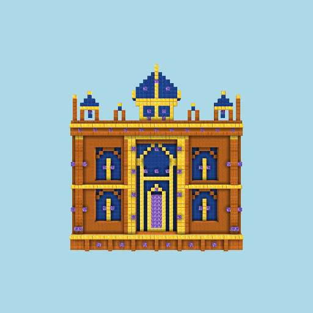

**strong** · 8802 blocks · 32855/71208 tok · $2.1434

> T-009-01 effort A/B: HIGH (--effort high)

### 027 — `vRefRevise-designdoc` · 2026-10-08

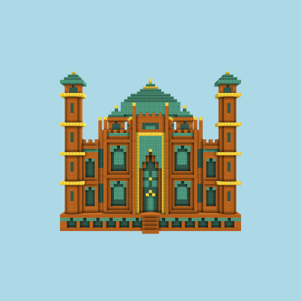

**strong** · 23467 blocks · 34/93811 tok · $3.3571

> opus-5-5 rerun of 014 (judge pinned opus-4-8)

### 028 — `v0-facade` · 2026-10-08

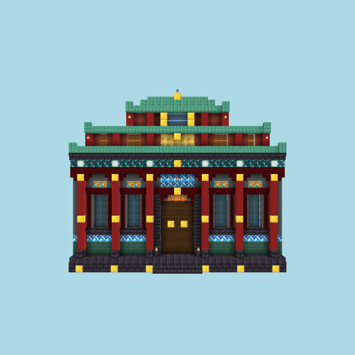

**strong** · 2319 blocks · 2/24022 tok · $0.7797

> opus-5-5 rerun of 001 (judge pinned opus-4-8)

### 029 — `vRefRevise-designdoc` · 2026-10-08

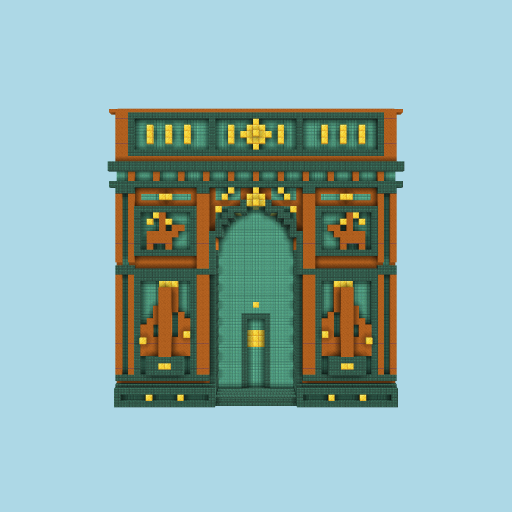

**strong** · 19456 blocks · 8/69409 tok · $2.3755

> opus-5-5 rerun of 021 (judge pinned opus-4-8)

### 030 — `v0-facade` · 2026-10-08

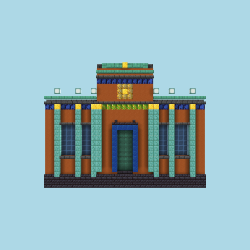

**strong** · 2639 blocks · 2/22512 tok · $0.0188

> haiku-5-5 rerun of 001/028 (judge pinned opus-4-8)

### 031 — `vRefRevise-designdoc` · 2026-10-08


**strong** · 2819 blocks · 6/78810 tok · $0.0606

> haiku-5-5 rerun of 014/027 (judge pinned opus-4-8)

### 032 — `vRefRevise-designdoc` · 2026-10-08

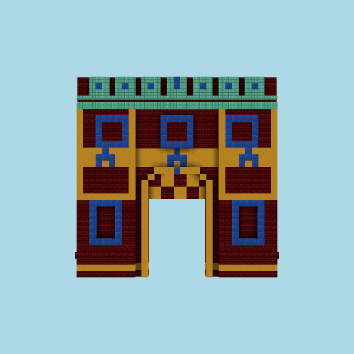

**strong** · 2312 blocks · 6/75276 tok · $0.0580

> haiku-5-5 rerun of 021/029 (judge pinned opus-4-8)

### 033 — `v0-facade` · 2026-10-08

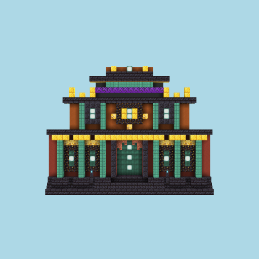

**strong** · 2392 blocks · 2/14159 tok · $0.2924

> sonnet-5-5 (judge pinned opus-4-8)

### 034 — `v0-facade` · 2026-10-08

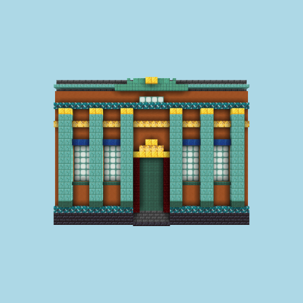

**strong** · 2778 blocks · 2/28960 tok · $0.0220

> haiku-5-5 effort max (judge pinned opus-4-8)

### 035 — `vRefRevise-designdoc` · 2026-10-08


**strong** · 10264 blocks · 6/54779 tok · $0.9718

> sonnet-5-5 Taj (judge pinned opus-4-8)

### 036 — `vRefRevise-designdoc` · 2026-10-08

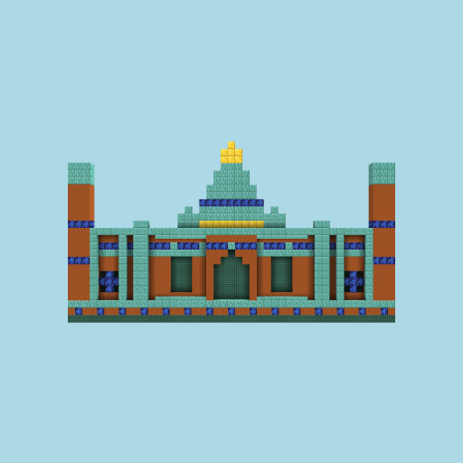

**competent** · 1277 blocks · 10/535461 tok · $0.3040

> haiku-5-5 effort max Taj (judge pinned opus-4-8)

### 037 — `vRefRevise-designdoc` · 2026-10-08

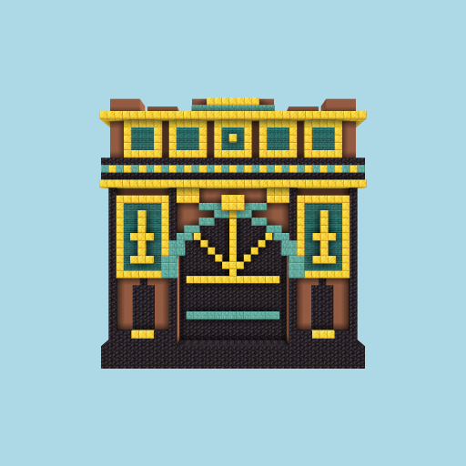

**strong** · 5771 blocks · 6/39475 tok · $0.8062

> sonnet-5-5 Arc (judge pinned opus-4-8)

<!-- RUNS:END -->
