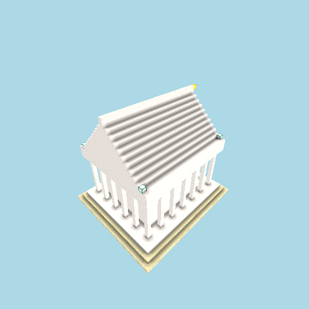

# Temple benchmark

A **persistent** design task — *"build a grand classical temple"* — that we throw at the
system repeatedly to track how the approach improves over time.

The **task** is held constant (`task.mjs`: the goal, seed, and world state), so renders
stay comparable. What varies between runs is the **approach** — archetype, prompt, DSL,
brief — recorded as each run's label. Every run saves its rendered build, and the
**Progression** gallery below regenerates automatically, so you can scroll it and watch the
temple get better as we refine the system.

## Run it

```bash
# LIVE & METERED — runs the model via the claude -p subscription shim (spec §4)
npm run bench:temple -- --approach <label> --note "what changed this time"
# e.g.
npm run bench:temple -- --approach v0-singleshot --note "baseline: free-form single-shot"
```

Each run lands in `runs/<NNN-approach>/`: `render.png`, `artifact.json`, `summary.json`,
`prompt.txt` (the transcript is saved too but git-ignored — it's large). The next run
auto-increments the sequence number.

## Approaches

- **`v0-singleshot`** — free-form single-shot via the `claude -p` path; uncapped,
  detail-inviting prompt (the deliberate opposite of the modest single-shot house brief).
- _Add a new approach in `run.mjs`'s `APPROACHES` map as the system is refined — e.g.
  `v1-iterative-multimodal` once S-005 (render → see → revise) lands._

## Progression

<!-- RUNS:START (generated by run.mjs — do not edit by hand) -->

| # | date | approach | blocks | tok in/out | cost | note |
|---|------|----------|--------|-----------|------|------|
| 1 | 2026-06-04 | `v0-singleshot` | 8018 | 9830/36479 | $1.0132 | baseline: free-form single-shot, uncapped detail-inviting prompt |

## Gallery

### 001 — `v0-singleshot` · 2026-06-04



8018 blocks · 9830/36479 tok · $1.0132

> baseline: free-form single-shot, uncapped detail-inviting prompt

<!-- RUNS:END -->
