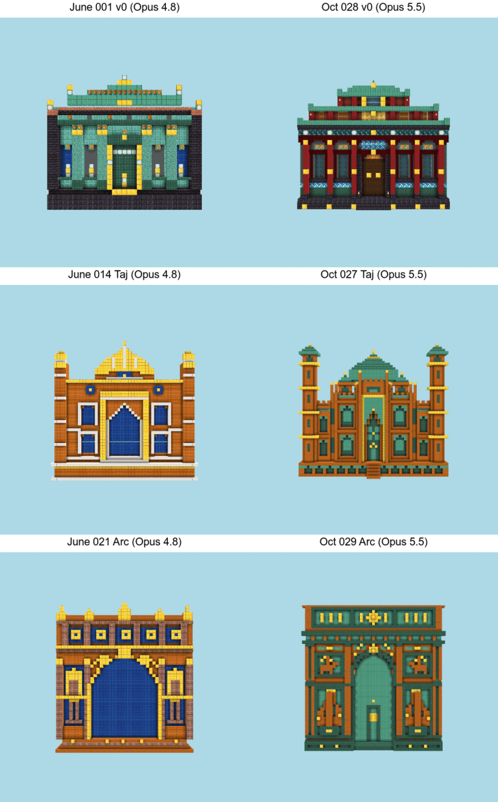
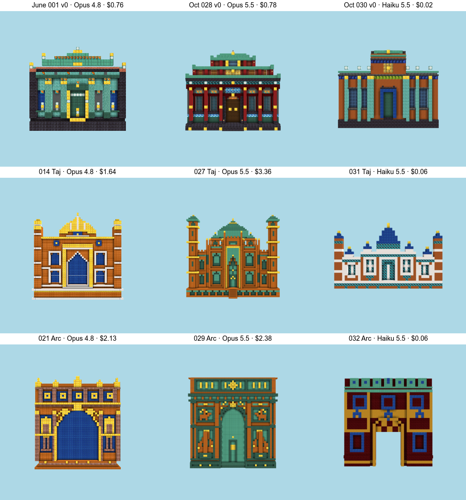
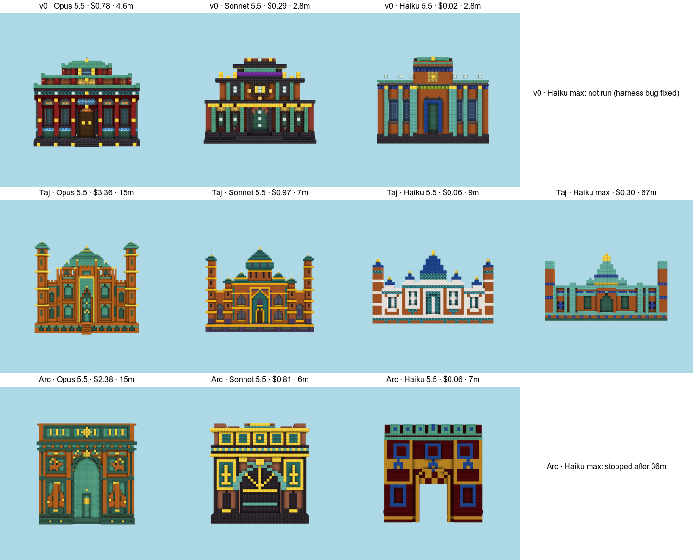
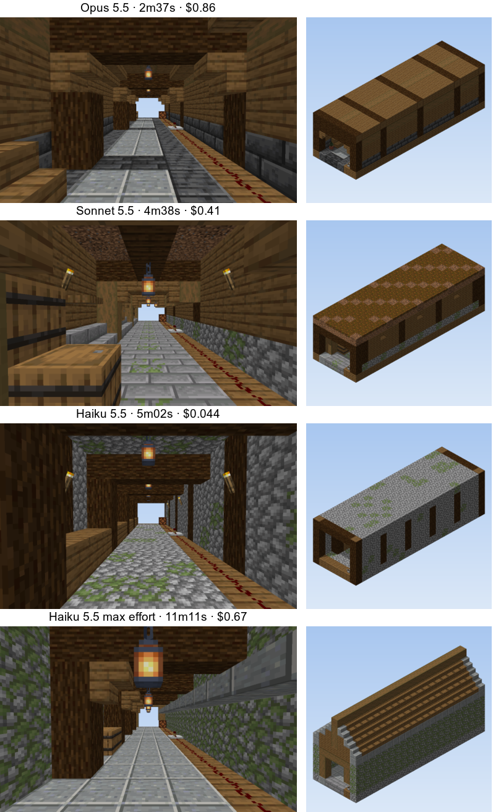
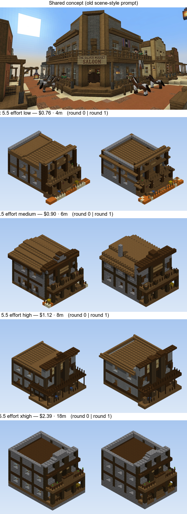

# What we learned — agent onboarding

*Written 2026-10-07 at project restart. Read this before anything else in `docs/`. It is the harvest
of June 2026 (E-01 … E-55, ~55 epics in two weeks), compressed for an agent picking the work back up.
Claims are tagged **[V]** verified in the repo record or **[I]** inference; evidence paths are given so
you can check rather than trust.*

---

## 0. TL;DR

1. **The facade system worked.** Model writes a design doc → model authors the JSON geometry directly →
   headless render → model revises against the doc. Strong 3/3 judge verdicts across five unrelated
   reference buildings for ~$1.50 a run. [V] §2
2. **The 3-D path (concept image → TRELLIS mesh → voxels → build) is what stalled the project.** Every
   surface *inherited* from the mesh failed; every surface *re-authored* from a recognized program
   passed. The last seven epics were spent tuning a judge to climb a mesh-derived seed that was broken
   at birth. [V] §3
3. **Representation decides success.** Use language for materials, the model for design intent,
   parametric code for precise placement, a VLM for judging renders. Don't route a decision through a
   representation that can't carry it (colour-matching can't tell brick from cobble; a 57k-voxel cloud
   overflows any context). [V] `pipeline-philosophy.md`
4. **The new direction (Oct 2026) is different:** *take a plain, functional build (e.g. a spruce-plank
   redstone hallway) and make it beautiful, without the user supplying every input.* It is a
   **transform** task, not a generation task, and it inherits the facade lessons almost directly. §5
5. **Watch the glance, not the metric.** Whenever a number and your eye disagreed, the eye was right.
   Many epics "moved the binding constraint" while the build stayed a D-. §4

---

## 1. Where the project stands

- **Paused 2026-06-18** after T-214 (E-55). Final state of the 3-D track: the gatehouse is still a dark
  closed box with a stepped cap and no gate, next to a concept that is a simple pale-stone gatehouse.
  Evidence: `docs/active/work/T-211-01/beside-kept.png`, `docs/active/work/T-214-01/verdict.md`. [V]
- **Restarted 2026-10-07** with a new motivating problem from the owner: *Opus 5.5 is excellent at
  redstone but builds plain, boxy structures. Prototyping redstone with it is hard because everything
  looks like a spruce box. We want a workflow a model can use to make a plain build beautiful
  without the user specifying everything.*
- **Governing docs from June** (`project-direction.md`, `anti-hedge-directive.md`, `milestones.md`,
  `pipeline-philosophy.md`) still describe the old framing: an eval-first portfolio artifact climbing
  toward a "Commissioned Village". Treat them as **history plus useful principles, not orders**. The
  owner sets the new direction. Anti-hedge (state how a direction could fail, run the attack, report it)
  and "glance beats gate" are worth keeping regardless.

---

## 2. What worked: the facade system (E-03 … E-08, June 4–5)

**Task.** "The full-quality FACADE of a TEMPLE, any style, colourful." Front elevation only, faces +Z,
relief into −Z. Code: `benchmarks/temple-facade/` (`run.mjs`, `task.mjs`, `judge.mjs`). [V]

**Representation.** One JSON `DesignArtifact` (`schema/design-artifact.schema.json`): `style`,
`palette.manifest` (block IDs), and ordered `placements[]` using four primitives: `voxel`, `line`,
`box`, `fill`. Last writer wins; **there is no air op**. The model authored the geometry itself, with
no brushes and no mesh. Expansion: `src/expand.mjs`. Validation: `src/artifact.mjs`. [V]

**Winning pipeline `vRefRevise-designdoc`** (three `claude -p` calls, `run.mjs` ~L862–945): [V]
1. Reference photo + brief → **design doc** (<400 words: lore, architectural logic, a 3–5-block palette
   with dominant/supporting/accent roles and a named harmony, motifs, proportion ratios).
2. Design doc → **artifact** at high resolution (~56 wide × 48 tall, relief depth up to ~24, full-width
   crown *required*).
3. Render → model sees **reference + its own render** → re-emits the whole artifact, anchored to the doc.

**Results** (judge: BAML categorical rubric, median of 3; `baml_src/judge.baml`): [V]

| Run | What changed | Overall | Notes |
|---|---|---|---|
| 001 | v0, plain prompt | 4.0 on old v1 numeric rubric | garish colour |
| 006 | lifted the size/relief caps | 3.0 → 4.0 | the model had been sitting exactly on the cap |
| 013 | reference = craft, brief = colour | competent | colour fixed; freestanding columns detached |
| **014** | + "a facade is ONE connected plane, no large flat fields" | **strong (3/3)** | hero: `pr/assets/frames/spine-r4-hero-oneplane-014.png` |
| 015 | same config | strong, all four dimensions strong | |
| 019 / 021 / 022 | off-domain refs (Hōryū-ji, Arc de Triomphe, mausoleum) | strong | generalizes |
| 020 | Sainte-Chapelle | competent | 2nd pass regressed |

26 runs in about two days at ~$0.76–2.18 each. Artifacts, design docs and prompts for every run are in
`benchmarks/temple-facade/runs/` (reference photos and raw transcripts are kept local only; the repo is
public). Principles P1–P15 are at the top of `docs/knowledge/design-learnings.md`.

### The rules it taught (all transfer to "beautify a plain build")

| Rule | Why | Evidence |
|---|---|---|
| **Raise the bar, never cap** | The model lands exactly on whatever limit it's given (relief "4–6" → every build at 4–6). Before calling something a ceiling, check it isn't a prompt limit. | P1, P7; runs 006 vs 004 |
| **Colour needs a reason, not permission** | "Be colourful" → garish. A dominant/supporting/accent scheme with a named harmony → strong. | P2; run 003 |
| **Design doc first; anchor every revision to it** | A bare "improve it" drifts toward bland white/blue/gold. A doc-anchored revision keeps the identity. | P3, P4 |
| **Say which input owns which axis** | A white Taj reference silently overrode "colourful". "Reference = craft, brief = colour" fixed it on 4 of 4 pale refs. | P12; runs 010→013 |
| **Translate dimensionality explicitly** | Freestanding minarets copied literally became floating pillars. One clause ("one connected plane") turned the revision from net-negative to net-positive. | P13; 013→014 |
| **A second pass is a coin-flip unless fenced** | It helped 014/019/021/022 and hurt 013/017/020. Judge round-0 *and* the revision and keep the better one. That was never automated. | P14 |
| **One pass can't push every dimension** | A "detail push" crashed colour (4→2.67, near-monochrome micro-texture) and cost depth. Push dimensions in separate, fenced passes. | P9; run 007 |
| **Detail is whack-a-mole** | Naming a flat field fills it, and the blankness moves to the largest unnamed surface. Needs a whole-surface ornament pass (never built). | P15 |
| **State every enforced rule in the prompt** | Rules the model can't infer from schema + prompt burn the retry budget. Teach them or have the compiler absorb them. | P11; memory `same-prompt-seam-handle-dont-reject` |
| **Recess by exclusion** | No air op + last-writer-wins means a niche placed behind a solid fill is buried. Build the mass *minus* the cavity; frames stand proud by +1. | `runs/009-vRef-designdoc/_gen.mjs` |
| **Output failures were narration, not truncation** | The model wrapped its JSON in prose. Forbid preamble; keep brace-slice + retry as backstops. | P10; `src/sdk-binding.mjs` |

**Limits it had.** It's literally a face (flat back). Curves come out stepped. `detail` never reached a
reliable "strong". The judge couldn't rank within the strong band; best-of-4 cost 7× for no gain. [V]

---

## 3. What stalled: the 3-D path (E-09 … E-55)

**Why it started.** Text → JSON nailed palette and parts on organic sculptures (moai, koi) but lost
continuous form. Image → 3-D (TRELLIS on Modal) → voxelize was a real form win *for sculptures*
(+0.238 mean IoU on 7 of 7 subjects, E-16/17). It was then carried over to buildings unchecked. [V]

**Why it failed on buildings, ranked:**
1. **The mesh was used as substrate, so the build inherited its errors.** [V] TRELLIS surfaces are
   stair-stepped (facet normals read 45° roofs as flat: `trellis-facet-normals-lie`). Double skins
   voxelize hollow. Spikes enter at voxelization. Plans come out ragged, with phantom openings (barn:
   96 holes). Architectural detail (arches, ridges, slit windows) is gone before voxelization starts.
   Thin subjects return HTTP 500. Each fix moved the problem one stage downstream.
2. **Reconstruction was the wrong frame.** Resemblance comes from *recognizing* forms and substituting
   canonical ones ("that lump is a gable"), not from measuring them. A no-regress check against the
   mesh actually *forbade* straightening a wall, because that lowered IoU against the noise.
   Recognition + pattern-book construction (E-31) gave the first composite pass: the barn, same-object
   at all 4 views, on the *untuned seed*. [V] `design-learnings.md` E-34 table
3. **Construction-model bugs** (downstream, not ceilings): the roof was a solid prism dropped on a box,
   a single-box builder couldn't represent a 2-mass cottage, `gableRole` was declared but never used.
   Building walls from the program closed them (barn closure 0.701 → 1.000). [V]
4. **The ruler problem (E-38 … E-55)** became its own 17-epic quest: VLM votes swing 0–76 on the same
   render, the median discarded the strong minority vote, the score read the style pack not the
   picture. **But there was nothing to rank.** Every build was the same D- (E-38), so no ruler could
   have shown progress. "The gate is the build, not the measure" (E-42). [V/I]
5. **Process amplifiers:** four parallel build chains (a fix landed in the wrong one), a pin-guard that
   froze drafts, a "GL absent" false probe that stopped loops rendering for two sessions, `npm test`
   green while the live chain was broken, seven epics on one house before a stop-line. [V]

**The final seed** that E-48…E-55 tried to climb is `benchmarks/sculpture/generated/gatehouse/artifact.json`
(`experiments/eval-alignment/picture-climb.mjs:60`), which was fitted to the mesh on June 11 and already
failed with all four views "drifted". [V]

**Would newer models change this?** [I] Better image→3-D helps but still needs recognition. Native
voxel / part-structured 3-D generation could remove the step that broke. The biggest lever is the one
that already worked: **have the model author a parametric program or the geometry directly.** The
target gatehouse is ~200 blocks; ask early "could the model just write this?"

---

## 4. Anti-patterns (each cost us real epics)

1. **Inherit from evidence.** Meshes, photos and references are *evidence* for recognition, never the
   substrate you edit. Re-author; don't fit.
2. **Patch instead of replace.** Covering a defect (fill the hole, paint one block) raised the score by
   *concealment*. Replacing a noisy component with a cleanly constructed one is what actually climbed.
3. **Freeze creation with measurement discipline.** Creation is iterative and free; measurement is
   frozen and singular. Merging the two cost ~25 commits and moved the glance zero (`defreeze-creation-loop`).
4. **Build the ruler before there's anything to rank.** You need a quality-*varied* set first.
5. **Gate per move on one scalar from a high-variance judge.** Votes of 8/0/48 on one move. Use
   trimmed means, compare candidates pairwise, keep the better one.
6. **Gates whose orderings contradict** (form-before-detail vs. "no new major defect" rolled back the
   correct move, T-214).
7. **Treat a moving "binding constraint" as progress.** Roof → measure → form gate, while the glance
   stayed D-.
8. **Green tests as delivery.** Run the actual chain and *look at the render* every loop
   (`src/view/render-beside.mjs`, `npm run render:beside`).
9. **No stop-line.** Set the stop-line in epic 1, not epic 7.
10. **Elaborate to hit a metric.** The minimal toolset scored best; adding tools made results worse.
11. **Measure the property you mean.** `closureOf` (fraction of the perimeter present) beats `coverage`
    for watertightness; a colonnade has coverage ≈ 1 and is full of holes.
12. **Colour-match materials.** Mean-colour matching collapses near-tone materials (stone brick vs.
    cobble). Material identity is *semantic*: pick by role and story (`material-identity-is-semantic`).

---

## 5. The new direction: beautify a plain build

**Problem (owner, 2026-10-07):** given a plain, functional build (spruce-plank hallway, the housing of
a redstone contraption), produce a beautiful version with human-builder-grade detail, inferring the
inputs a user would otherwise have to supply (style, palette, motifs).

**Why this is more tractable than the 3-D path** [I]: the input is already clean, rectilinear and
correct, so there's no noisy evidence to inherit. The task is *recognition + substitution + ornament*
on a known form, which is exactly what worked (facades; E-31 recognition). And it can be checked at a
glance, before vs. after.

**What carries over:**

| June lesson | Implication for beautify |
|---|---|
| Design doc first | Infer a design doc from the build + context (biome, purpose, nearby builds) *before* placing anything. That doc is how the model "fills in the inputs the user didn't give". |
| Colour needs a reason | Palette by role (dominant/supporting/accent) with a named harmony and a diegetic story ("a mine-cart station in a spruce taiga"). |
| Raise the bar, never cap | Ask for depth and layering explicitly (pillars proud by 1–2, recessed panels, ceiling beams, floor inlays). The model will under-detail to whatever bar it infers. |
| Recess by exclusion / last-writer-wins | Decoration must never overwrite a protected cell. Build *around* the function. |
| Reference owns craft, brief owns colour | If the user gives a reference image, say which axis it owns. |
| Fenced passes, keep-the-better | Structure pass (pillars, arches, beams) → material pass → detail/ornament pass, each judged against the previous result, with rollback. |
| Brushes for precise repetition | Repeating bays (every N blocks: pillar + arch + lantern) are what parametric code is good at. Let the model design the bay; let code tile it. |
| Glance beats gate | Before/after renders from the player's eye height inside the hallway, not just exterior 3/4 views. |

**New constraint the June work never faced: preserve function.** [I] Redstone builds have hard
invariants: dust and repeater lines, observer faces, piston push clearance, quasi-connectivity,
slime/honey adjacency, and blocks that conduct or block power (solid vs. transparent, so glass vs.
stone *changes behaviour*). Any beautify workflow needs a **protected-cell mask** plus a
**clearance/adjacency rule set** that decoration can't violate, and ideally a functional check. A
simulated redstone tick isn't in this repo, so that would be new work. Decorating *outside* the
functional volume (a shell around it) is the safe first scope.

**Cheapest first experiments** [I]:
1. Hand-author a plain spruce hallway artifact (~5×5×20) and ask the current model, with the facade
   prompt discipline (design doc → build → render → revise), to beautify it with no other input.
   Judge the before/after renders at a glance.
2. Same, with a marked protected volume (a redstone line along the floor), and check zero protected
   cells were touched.
3. Only after 1–2 show where it breaks: add brushes or a bay-tiling step for the failure you saw.

---

## 6. Harvestable code (works without the 3-D path)

| Area | Where | Notes |
|---|---|---|
| Headless render (no server) | `render/` (`world.mjs`, `render.mjs`, `camera.mjs`, `orbit*.mjs`) | prismarine-viewer + node gl. Postinstall patches the viewer's stairs bug (`patch-viewer-lens.mjs`; `lens-guard.mjs` throws if the patch is missing). MC 1.20.1. |
| Multi-view / beside renders | `src/view/multi-angle.mjs`, `src/view/render-beside.mjs`, `src/render-supersample.mjs` | Fail-loud GL check. |
| Artifact contract | `schema/design-artifact.schema.json`, `src/artifact.mjs`, `src/expand.mjs` | ajv; 4 primitives; block states for stairs/slabs. |
| Block vocabulary / colour | `src/form/block-vocab.json`, `src/color/*` | CIELAB tables (fine for "which block", wrong for material identity). |
| Model seam | `src/sdk-binding.mjs`, `src/config.mjs` | `claude -p` stream-json shim. `MC_MODEL_ID` / `MC_JUDGE_MODEL_ID` override builder/judge models. |
| Facade benchmark | `benchmarks/temple-facade/`, `baml_src/{facade,judge}.baml` | `npm run bench:temple-facade -- --approach vRefRevise-designdoc --ref references/` |
| Brushes (construction) | `src/view/{wall-generate,wall-skin,roof-generate,arch-frame,opening-dressing,surface-relief,treatment-grammar}.mjs`, `src/form/idiom-constructs.mjs`, `src/pack/idiom-registry.mjs` | Pure code, well tested. `npm run brush:catalog`. |
| Style packs | `packs/*.json`, `src/pack/{style-pack,formation}.mjs`, `palettes/` | Material story → palette → proportions. |
| Judge robustness | `src/form/judge-reply.mjs`, `src/baml/reply-policy.mjs`, `src/workshop/climb-gate.mjs` | Malformed ≠ verdict; bounded re-asks; vote aggregators (trimmedMean won). |
| Workshop loop | `src/workshop/{loop,actions,replay}.mjs` | Ledgered, replayable revise rounds; works on any artifact. |

**Leave behind:** `src/form/glb-*`, the `*-fit.mjs` modules, `benchmarks/sculpture/` chain scripts
(`build:*`, `sketch:*`, `skin:*`, …), `src/sculptor/`, `src/revise/`. They are mesh-path code.

---

## 7. Opus 5.5 rerun of the facade benchmark (2026-10-07)

*Builder `claude-opus-5-5`, judge pinned to `claude-opus-4-8` (the June judge) so only the builder changed.*

Same prompts, same references, same harness as June. Only the builder model changed. [V]

| Pair | June (Opus 4.8) | Oct (Opus 5.5) | Glance verdict |
|---|---|---|---|
| v0 one-shot, plain prompt | 001: 2,908 blocks, $0.76 | **028**: 2,319 blocks, 275 s, $0.78 | **Clearly better.** Coherent red/teal/gold East-Asian scheme, layered roofs, real bays, vs. June's garish, muddy front. The biggest jump, at the same cost. |
| Taj ref (`vRefRevise`) | 014: 10,013 blocks, 1,100 s, $1.64 | 027: 23,467 blocks, 881 s, $3.36 | More ambitious (capped minarets, dome, parapets, steps, arcaded plinth) but busier, with a narrower portal. More detail, not decisively better; 2× the cost. |
| Arc ref (`vRefRevise`) | 021: 12,696 blocks, 1,006 s, $2.13 | 029: 19,456 blocks, 887 s, $2.38 | **Better.** Real relief panels, an attic band, a dressed archivolt; reads more like the Arc. |

- **The judge saturated:** all three October runs scored "strong" on all five axes. The June rubric can
  no longer separate builds at this level. Use pairwise before/after comparison (and the human glance),
  not a categorical score.
- **Most important for the new direction:** the *plain one-shot* improved the most. A strong base model
  plus good prompt discipline gets most of the way without a heavy pipeline.

### Haiku 5.5 on the same benchmark (2026-10-08)

Same harness, judge still pinned to Opus 4.8. [V]

| Run | Time | Cost | Blocks | Judge (overall / detail) | Glance |
|---|---|---|---|---|---|
| 030 v0 | 165 s | **$0.019** | 2,639 | strong / competent | Competitive: coherent and colourful, cleaner than June's 001, less refined than Opus 5.5's 028 |
| 031 Taj | 542 s | **$0.061** | 2,819 | strong / competent | Behind: low, wide and sparse, thin relief. Opus built 10–23k blocks |
| 032 Arc | 412 s | **$0.058** | 2,312 | strong / competent | Weakest: a chunky gateway with crude, garish motifs |

- **Haiku 5.5 is 40–55× cheaper.** It holds up on short, simple tasks but **scales down** the long,
  reference-grounded high-res ones: it ignored "build big" and lost detail.
- The judge still says "strong" for everything; it can't separate these.
- **The plugin end-to-end test on Haiku** (`minecraft-design`, same hallway prompt): 5 min 2 s, **$0.044**, 0 function
  violations. It produced a sensible rock-cut mine identity, rougher than Opus 5.5 ($0.86): a busy mossy floor,
  leftover torches, a single round. A cheap decorator is viable for iterating; Opus for the final pass.

### Model and effort sweep: Opus / Sonnet / Haiku 5.5 (2026-10-08)

Same harness, judge pinned to Opus 4.8. [V]

| | Opus 5.5 | **Sonnet 5.5** | Haiku 5.5 | Haiku 5.5, `--effort max` |
|---|---|---|---|---|
| v0 one-shot | $0.78 · 4.6 min | **$0.29 · 2.8 min** | $0.02 · 2.8 min | (034 ran at default effort: harness bug, now fixed) |
| Taj reference | $3.36 · 15 min · 23k blocks | **$0.97 · 7 min · 10k** | $0.06 · 9 min · 2.8k | $0.30 · **67 min** · 1.3k · judge "competent" |
| Arc reference | $2.38 · 15 min · 19k | **$0.81 · 6 min · 5.8k** | $0.06 · 7 min · 2.3k | stopped after 36 min |
| Plugin hallway e2e | $0.86 · 2.6 min | $0.41 · 4.6 min | $0.044 · 5 min | $0.67 · 11 min · 55 turns |

- **Sonnet 5.5 is the price/quality sweet spot** for single builds: its Taj is close to Opus at about ⅓ the cost.
- **Max effort did not help Haiku on single-shot generation.** It emitted 535k output tokens over 67 minutes for a
  smaller, flatter facade. It **did** help on the agentic plugin task: two rounds, a pairwise keep, and a form
  change (a gabled roof), at near-Opus cost and 4× the time. Effort pays when the model iterates with tools, not
  when it writes one big artifact.
- **The categorical judge still can't separate the models.** Everything scores "strong" except Haiku-max's Taj.
- The `v0-facade` approach silently ignored `--effort` before this sweep; it's fixed in `run.mjs`.

### Sonnet 5.5 effort sweep on a new subject (old west saloon, 2026-10-08)

Concept builds (concept → doc → build → revise) from one shared concept image, with the judge changed to Opus 5.5:
a categorical grade per build, plus 3 blind shuffled rankings of all 8 builds (4 efforts × 2 rounds). [V]

| Effort | Cost | Time | Mean rank (r0 / r1, of 8) |
|---|---|---|---|
| low | $0.76 | 4 min | 4.0 / **3.0** |
| medium | $0.90 | 6 min | 4.0 / 3.7 |
| high | $1.12 | 8 min | 3.7 / 7.0 |
| xhigh | $2.39 | 18 min | 5.0 / 5.7 |

- **Effort isn't the lever.** xhigh cost 3× low and took 4.5× as long for no visible gain; every build got a
  "competent" grade. Use low or default effort for Sonnet on this pipeline.
- **The blind rankings disagreed wildly across shuffles** (xhigh r0 came 1st in one and 6th in another): the builds
  really are about the same quality, and no judge can rank a flat field. Judging needs clearly separated builds or
  a human glance.
- The shared concept was the old scene-style prompt. The bigger lever is probably the reference-sheet concept
  (see the concept bake-off).

### Why the good-looking approach is slow (from the transcripts)

Measured on 014 and 027. [V]
- **Wall-clock ≈ output tokens ÷ ~75–115 tok/s.** 014's build call: 26k tokens, 339 s.
- **Most tokens aren't the build.** 014's artifact is ~8k tokens of JSON; its build call emitted 26k.
  The rest is coordinate reasoning: every pillar, frame and recess placed so it stays symmetric,
  aligned and correctly layered. **Detail = many mutually constrained coordinates.** A rough functional
  pass (big boxes, few constraints) is fast for exactly this reason.
- **Each revision re-emits the whole artifact** rather than a diff.
- **Unplanned agentic detours:** in 014 the revise call spent 10 shell calls discovering how to render,
  wrote a generator, rendered itself, then returned prose instead of JSON. That cost ~6.5 min and $1.66
  and forced a retry. In 027 the build call did the same (15 turns, ~7 min).
- **The tell:** given tools, the model wrote *code*, not coordinates (`runs/014-…/_gen.mjs`: fill /
  delete / mirror helpers, carve by exclusion, greedy-meshed into fills).
- **Implication:** give the model a helper vocabulary (mirror, tile-a-bay, pillar, arch, frame, carve),
  revise by patch, and pre-wire the render tool. Then cost scales with design decisions, not block count.

### Next: the `/minecraft-beautify` skill (proposal, 2026-10-07)

A standalone agent skill, usable wherever an agent already has a build in context (a row of template
houses, a highway, a redstone hallway). It packages this doc's lessons as:
- **Doctrine** (`SKILL.md`): infer a brief → design doc with palette roles → protect function → fenced
  passes (structure → materials → depth → ornament → light/landscape) → render → keep the better.
- **Toolkit:** I/O adapters → canonical voxel grid; analysis (surfaces, bays, symmetry, flat-field
  census); protected-cell mask; helper vocabulary; patch-based edits; a portable renderer; cheap lints.
- **Playbooks:** per domain (interiors, house rows, roads, bridges, walls, redstone housings) plus a
  palette library.

Failure modes to test for: style collapse (everything turns cobble-and-oak), over-decoration, broken
function, too slow. Fixture set: plain hallway, template-house row, highway segment, redstone housing,
bridge, judged pairwise before/after. Open question: which I/O format the redstone session produces.

---

## 8. Pointers

- Setup: `README.md` → "Setup on a fresh clone".
- Architecture of record (June): `docs/knowledge/pipeline-philosophy.md`.
- Full journal (262 KB, chronological): `docs/knowledge/design-learnings.md`. Grep it; don't read it.
- Retro + findings: `docs/findings/2026-06-15-*.md`, `docs/active/ROADMAP.md`.
- Archived epics/tickets E-01…E-38: `docs/archive/2026-06-15-foundations-through-measurement/`.
- E-39…E-55 work dirs: `docs/active/work/T-*`.
