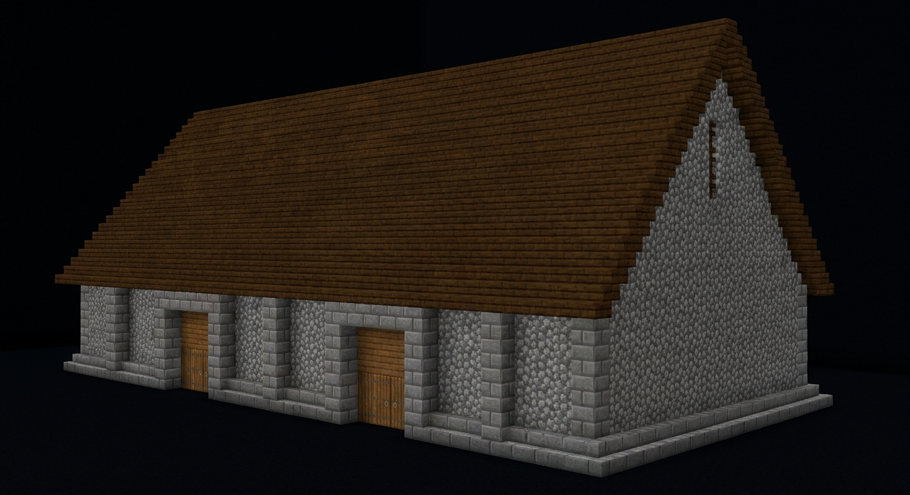
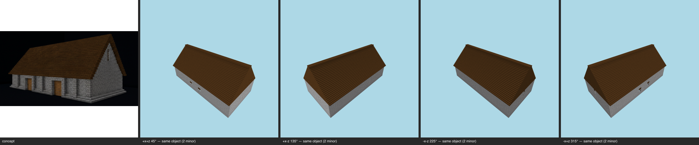
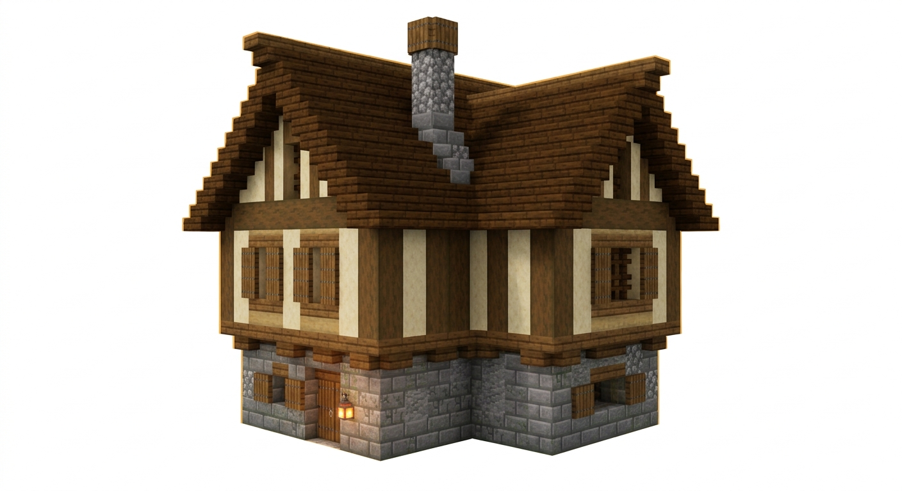

# The proportion milestone — E-33 terminal (T-138-01)

The question the epic asked back: **does the form read right now?** Per subject: the
re-seeded measured program, the workshop under the armed proportion check with live geometry
levers, the frozen gate's verdict beside its pre-rotation baseline, and the glance — concept
beside sheet. Baselines: `benchmarks/sculpture/pattern-book/proportion-baselines.json` (retired pins named there with their shas).

## barn (pack `rustic`)

| concept | gate sheet |
| --- | --- |
|  |  |

**Ratios (silhouette, prefix-replayed)** — targets ridge:eave 2.1 / roofShare 0.5238 / aspect 1.8462:

| | ridge:eave | roofShare | aspect |
| --- | --- | --- | --- |
| baseline final | 2.4444 | 0.5909 | 2 |
| re-run seed | 2.4 | 0.5833 | 1.8462 |
| re-run final | 2.1667 | 0.5385 | 1.8462 |
| Δrel vs target (baseline → final) | 0.164 → 0.0318 | 0.1281 → 0.0281 | 0.0833 → 0 |

**The hands** (ledger `benchmarks/sculpture/workshop/barn.json`): outcome **done**, geometry-bearing rounds: round 1 geometry {"eaveHeight":12} — ACCEPTED; round 2 geometry {"depth":26} — ACCEPTED.

**Verdict vs baseline** (gate `benchmarks/sculpture/multi-angle/barn-patternbook.json`):
- identity arithmetic: 4/4 same-object (baseline 4/4); severities {"minor":8} (baseline {"minor":8})
- budget arithmetic: 8/2 gaps → FAIL (baseline 8/2 → FAIL)
- REVIEWER: both arithmetics above are reported, not reconciled — whether the ≤2 gap budget should pass a decided all-minor verdict is E-33's open recalibration question (Rule 3), not decided here.

## barn--saltcrag (pack `saltcrag`)

| concept | gate sheet |
| --- | --- |
|  |  |

**Ratios (silhouette, prefix-replayed)** — targets ridge:eave 2.1 / roofShare 0.5238 / aspect 1.8462:

| | ridge:eave | roofShare | aspect |
| --- | --- | --- | --- |
| baseline final | 2.4444 | 0.5909 | 2 |
| re-run seed | 2.4 | 0.5833 | 1.8462 |
| re-run final | 2.1667 | 0.5385 | 1.8462 |
| Δrel vs target (baseline → final) | 0.164 → 0.0318 | 0.1281 → 0.0281 | 0.0833 → 0 |

**The hands** (ledger `benchmarks/sculpture/workshop/barn--saltcrag.json`): outcome **done**, geometry-bearing rounds: round 1 geometry {"eaveHeight":12} — ACCEPTED; round 2 geometry {"depth":26} — ACCEPTED.

**Verdict vs baseline** (gate `benchmarks/sculpture/multi-angle/barn-patternbook-saltcrag.json`):
- identity arithmetic: 4/4 same-object (baseline 4/4); severities {"minor":8} (baseline {"minor":8})
- budget arithmetic: 8/2 gaps → FAIL (baseline 8/2 → FAIL)
- REVIEWER: both arithmetics above are reported, not reconciled — whether the ≤2 gap budget should pass a decided all-minor verdict is E-33's open recalibration question (Rule 3), not decided here.

## cottage (pack `rustic`)

| concept | gate sheet |
| --- | --- |
|  |  |

**Ratios (silhouette, prefix-replayed)** — targets ridge:eave 1.4145 / roofShare 0.293 / aspect 1.1852:

| | ridge:eave | roofShare | aspect |
| --- | --- | --- | --- |
| baseline final | 2.25 | 0.5556 | 1.0769 |
| re-run seed | 1.55 | 0.3548 | 1.1852 |
| re-run final | 2.75 | 0.6364 | 1.0769 |
| Δrel vs target (baseline → final) | 0.5907 → 0.9441 | 0.8962 → 1.172 | 0.0914 → 0.0914 |

**The hands** (ledger `benchmarks/sculpture/workshop/cottage.json`): outcome **budget-exhausted**, geometry-bearing rounds: round 4 geometry {"storeys":3} — ACCEPTED; round 6 geometry {"storeys":4,"storeyHeight":4} — rolled back (regressed: passed 6→6, findings 2→2; ridgeToEave Δ 2.8883→3.5953 beyond tolerance).

**Verdict vs baseline** (gate `benchmarks/sculpture/multi-angle/cottage-patternbook.json`):
- identity arithmetic: 2/4 same-object (baseline 0/0, 4 views coverage-refused); severities {"minor":7,"major":4} (baseline {})
- budget arithmetic: 11/2 gaps → FAIL (baseline 0/2 → FAIL)
- REVIEWER: both arithmetics above are reported, not reconciled — whether the ≤2 gap budget should pass a decided all-minor verdict is E-33's open recalibration question (Rule 3), not decided here.

---

Replay: `npm run milestone:proportion:repro` (byte-identical, no model, no GL). The chain
records carry the measured-program sources/conflicts; the gate records carry both coverage
arithmetics per view (T-137). E-12 handoff: this page + the JSON record beside it.
